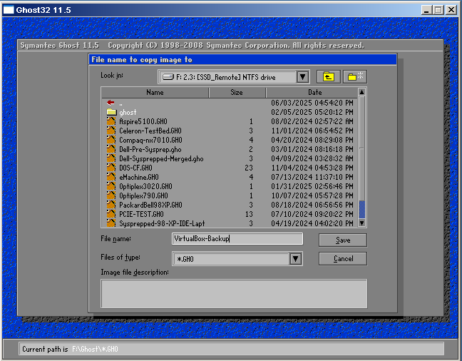

Windows 98 has a frustrating habit of corrupting itself after installing questionable drivers, booting the OS with untested memory, or making system changes without thinking through the consequences. The non-journaling nature of FAT32 makes it particularly vulnerable to corruption during unsafe shutdowns - and Windows 98's tendency to hang means you'll be reaching for that reset button more often than you'd like.

Unlike modern Windows which installs in ~20 minutes, getting a retro system back up and running can be genuinely painful - finding drivers for obscure hardware can take hours, and dual boot setups are particularly time-consuming to recreate.

Don't get me wrong - reinstalling and configuring systems is part of the fun for many _(myself included)_, but when you want to _use_ your machine, it's highly frustrating when you turn it on to discover it needs a reinstall.

I've tried multiple backup methods over the years, and in my opinion this approach is by far the simplest and most effective I've found. It works from a **bootable CD, needs no software installation, and can restore a completely working system in minutes** instead of hours.

*Uh-oh, this drive is on the way out! At least we have a backup... right?*

## TLDR for the Experienced

- Download [Hiren's Boot CD 9.9](https://www.hirensbootcd.org/hbcd-v99/) ISO
- Burn the ISO to CD, or use Rufus to make a USB
- Select Live XP environment from the boot menu
- Run Norton Ghost from the HBCD menu
- Backup From Disk to Image, storing on USB drive

For the vast majority of people, this is the happy path. However, there are exceptions, alternatives and considerations, so it's worth reading on.

## The Solution

This approach combines two legendary tools: **Hiren's Boot CD** and **Norton Ghost**.

Hiren's Boot CD is a collection of system recovery and diagnostic tools that's been around for decades. It boots into a live environment that runs independently of your installed operating system, making it perfect for backup and recovery work, especially when your main system won't boot. It also includes tools for memory testing, password resetting, partition resizing, virus scanning, and dozens of other utilities that IMO make it a "must have" in any retro toolkit.

Norton Ghost is the disk imaging software we'll be using for the actual backup and restore operations. I've tried many different backup solutions over the years, but I keep coming back to Ghost. It's incredibly reliable, has a straightforward interface, and just works consistently on retro hardware without fuss.

It's worth noting that Ghost was a _commercial product_ from Symantec. However, the older versions we're using are so easily found online that they effectively fall under the abandonware category, as they're no longer sold or supported by the company.

For this guide, I recommend [Hiren's Boot CD 9.9](https://www.hirensbootcd.org/hbcd-v99/). It's a smaller download at ~100MB and includes Norton Ghost built-in, which is exactly what we need. [Hiren's Boot CD 15.2](https://www.hirensbootcd.org/hbcd-v152/) was the last version released with an XP environment and has a more comprehensive toolkit. However, it's also a much larger download at ~700MB, doesn't include Ghost by default and I often find it slower to launch. You can still use it by [copying Ghost](https://superuser.com/questions/716641/add-ghost32-to-hiren-s-cd-15-2) from version 9.9, or downloading the full Ghost package from [archive.org](https://archive.org/search?query=Norton+Ghost), but 9.9 is simpler.

Download whichever ISO you prefer, though you'll want to do this on a modern machine rather than your retro system - old Windows 98/XP machines really aren't suitable for online use these days, lacking modern security and browser support.

### USB or CD?

Before choosing how to create your boot media, you need to understand what your machine can actually use! Go into the BIOS settings and check two things: can it boot from CD, and can it boot from USB?

*Every BIOS is different, but it's usually a pretty obvious setting.*

Most computers that can run Windows 98 or XP can boot from CD - it's been standard since the mid-90s, but USB boot support is far less ubiquitous. Look for options like "USB-HDD" or "USB Storage" in the boot order settings. If you see these, your machine probably supports USB booting, though there may be limitations.

Next, determine what USB version you have. Check the hardware summary screen when your machine starts up - it will often display "USB 1.1 Controller" or "USB 2.0 EHCI Controller" as it lists detected devices. You can also check your motherboard manual to be sure. Be aware that some motherboards can only boot from the 1.1 ports even if they have 2.0 functionality, and the vast majority of PCI USB cards don't support booting at all.

If you only have USB 1.1, this is still a valid approach if you have enough time on your hands, though you'll face significant limitations. A typical 5GB backup would take over an hour to transfer at USB 1.1 speeds (~1MB/s), compared to just a few minutes with USB 2.0 (~30-40MB/s). Additionally, many USB 1.1 systems have disk size limitations, often maxing out at 2GB or 8GB, which may not be sufficient for larger backup images.

If your machine has CD boot support and only USB 1.1, go with CD - it'll be much faster. If you have USB 2.0 and confirmed USB boot support, USB becomes an attractive option for convenient and frequent use.

For USB creation, [Rufus](https://rufus.ie/) is a straightforward option - give it an ISO and a USB stick and you will magically have a bootable stick!

*Rufus makes creating bootable USB sticks simple - just select your device and ISO file.* 

[Ventoy](https://www.ventoy.net/) is more versatile - install it once to a USB stick and then copy as many ISOs over as you want. Simply pick which ISO you want to boot from at boot time. Ventoy even lets you store your backup images on the same USB device you booted from using its reserved partition feature. 

*Ventoy lets you choose from multiple ISOs at boot time - very handy for managing different tools.*

I mostly use Ventoy for convenience, but it comes with its own caveats, so for the purpose of this guide *I won't recommend it* - but I wanted to put this fantastic tool on your radar, if it isn't already.

One thing to keep in mind is that although an XP installation may run on 64MB, the Live XP environment in **HBCD needs ~256MB**. RAM is cheap for retro systems, so if you're running less than this, it's worth adding more anyway.

If you have enough RAM, but can't boot from CD, use [PLOP boot manager](https://www.plop.at/en/bootmanagers.html) on a floppy disk to enable CD booting.

If you don't have enough RAM, you can install Norton Ghost directly to your existing OS using one of the installers from [archive.org](https://archive.org/search?query=Norton+Ghost). During installation, it offers to create a bootable recovery floppy that runs Ghost in a minimal DOS environment. This uses much less memory than the Live XP environment, though it may struggle to access USB drives and other modern storage devices since it lacks the underlying OS driver support that the XP environment provides.

If all else fails, just pull the drive and connect it to a modern machine using a USB-to-IDE/SATA adapter. This approach is universal no matter the state of the machine. Ghost32.exe is fully portable and runs on Windows 11 without issues, so you can create your backup images on a modern system with full USB 3.0 speeds and plenty of storage space.

### Where to Store Your Backups

Now we have our bootable medium, it's time to think about where to store your backups.

**USB Storage** is the most popular choice - it's portable and requires no hardware modifications. Instead of traditional USB sticks, consider using USB-to-SATA adapters with small SSDs - they're often cheaper per GB, more reliable, and let you repurpose older drives.

*[CeX](https://webuy.com) has SSDs for £4 - perfect for backup storage.*

**Second Internal Drive** is the fastest option for backup and restore operations since you're reading and writing at full IDE/SATA speeds rather than being bottlenecked by USB performance. This requires opening the case and installing an additional compatible IDE or SATA drive.

**Backup Partition** on your existing drive requires no additional hardware - you simply create a dedicated partition to store your backup images. This is convenient but limited by your original drive space, and you'll lose your backups if the drive fails completely, so it's best used alongside other backup methods.

**DVD Backup** is also supported by Norton Ghost, though I've never tried it myself. With high-capacity USB storage being so affordable now, this method has become largely obsolete for most users.

### Strategic Partitioning for Smarter Backups

One of the most effective approaches is to partition your drive thoughtfully from the start. Keep your C: drive small (8-15GB) for operating systems only, and put games, applications, and data on a separate D: drive partition. This keeps your OS partition small and quick to backup, and you won't need to create new backups every time you install a game.

Ghost can backup and restore individual partitions, not just whole drives. This means you can restore a corrupted OS without affecting your game collection, keeping games and save data intact during system recovery. You can install new games on D: without affecting your clean OS backup, experiment with system changes knowing you can quickly restore C: only, and your games partition rarely needs backing up once populated. Some games might require a reinstall if they made registry changes, but most will work fine.

*HBCD includes plenty of partition tools if you need to resize or reorganize existing drives.*

Windows 98 can't read/write past the first 137GB of a drive _(which you knew, right?)_, so if you're using something like a 160GB drive, you can create a final partition beyond 137GB as NTFS for storing your Ghost backups. Windows 98 will simply ignore it, but XP (or your modern machine) can access it fine for backup storage.

If you've already done your OS install and want to change your partition layout, you can always use one of the many partition resizing tools included on Hiren's Boot CD to alter things without starting from scratch.

## Booting into Hiren's Boot CD

Once you've created your bootable medium and configured your BIOS boot order, you're ready to boot into Hiren's Boot CD. Make sure any USB drives or external storage you plan to use for backups are already connected before booting - the Live XP environment doesn't always recognize new drives that are plugged in after it's already loaded.

*This is what you should see if your bootable medium is working correctly.*

From the boot menu, select **"Start Mini Windows XP"** to launch the full Windows XP environment. Partition tools etc. are in the "Start BootCD" menu and most of these tools can't be accessed from within he XP environment.

Once loaded into the XP environment, you'll see the HBCD WinTools menu - click "Browse" to bring up the list of software.

*Open "Ghost32.bat" from the WinTools folder to launch the backup tool.*

*Norton Ghost is now running and ready for backup operations.*

When Ghost launches, it has been extracted to the RamDrive temporary space. If you want to keep a portable copy of Ghost handy for future use, now is a good time to copy the Ghost32.exe file to your USB stick - this makes it available for direct use on any Windows system without needing the full HBCD environment.

## Making Backups

Norton Ghost's interface is refreshingly simple, and the "From" and "To" terminology makes the direction of data flow crystal clear. For creating a backup, you want to go **From** disk **To** image. If you have multiple partitions in a similar pattern that I outlined above, then you could instead do **From** partition **To** image if you only wanted to backup the OS, for example.

Select Local -> Disk -> To Image to create a backup of your entire disk, or Local -> Partition -> To Image for a single partition. Pretty obvious, right? Once selected, it'll take you to the next screen to select your source disk.

Choose your source disk - in this VM example it shows "VBOX HARDDISK" but on real hardware you'll see your actual drive model. The "Sabrent" entry here is the USB storage device.

If you selected to backup just a partition, Ghost will ask which one you want to back up, otherwise it'll go straight to the next step, where you'll be prompted to choose where to store the backup file to.

Select your USB stick or backup destination and give the backup file a descriptive name.

Ghost may ask additional questions during the backup process such as if you want to use compression. Compression is usually slower but saves space - "Fast" is typically the best balance.

Ghost will ask for final confirmation before starting the backup process. Check the summary and if you have any doubts, just press No, go back to the main menu and start again.

Once the backup starts, you'll see a progress bar. Time to put the kettle on and have a cup of tea - this can take a while depending on the speed of your machine and storage medium _(wait... is that why it's called Ghost?)_.

Success! Your backup is complete. You can now safely shut down the machine and remove the HBCD media.

## Restoring from Backup

When disaster strikes and you need to restore your system, the process is essentially the same as backing up, but in reverse. Boot into HBCD and launch Norton Ghost just as before.

For restoration, select Local -> Disk -> From Image to restore an entire disk image, and for a partition, you guessed it, Local -> Partition -> From Image. You can restore a single partition from a full disk image too which is handy.

Browse to and select the backup image file you want to restore. 

⚠️ Choose your destination disk very carefully! This is far more dangerous than backing up the wrong drive - you can accidentally overwrite important data if you select the wrong destination. 

In this VM example it shows "VBOX HARDDISK" but on real hardware you'll see your actual drive model that should match what's shown in your BIOS. If you're unsure, restart and check your BIOS first - it's not worth getting this wrong and potentially destroying data on the wrong drive!

When restoring a whole disk, Ghost gives you the option to specify partition sizes. This is incredibly handy for moving backups between different sized drives or changing your partition layout without separate resizing tools.

Final confirmation before restore begins. Double-check everything is correct - you really don't want to mess this up! And time for another cup of tea...

Restoration complete! Remove the HBCD media, restart your machine, and you're golden.

## Final Thoughts

I've managed to take something quite simple and make it seem complex by possibly over-explaining it, but here we are. The reality is that Norton Ghost is remarkably straightforward once you've done it a few times - the interface is intuitive and the process is reliable.

In my experience, Ghost backups are far more likely to work when moved between machines compared to other imaging solutions, which often fail when transferred to different hardware. XP installs can be fragile though, and in many instances you may need a repair install over the top of a restored image, but that's still far quicker than a full reinstall and crucially, everything will be exactly as you left it.

Having a solid backup strategy transforms how you use your retro systems. Instead of being cautious about experimenting with drivers or system modifications, you can be bold knowing that a complete recovery is just minutes away. When that inevitable corruption happens, you'll be back up and running with a cup of tea instead of spending your evening hunting down drivers and reinstalling software.