A while back, I found my scrap dealer standing his heavy boots on a Ryzen CPU in terrible shape. Unfortunately, he wouldn't know the difference between a Ryzen and a Celeron - it's all metal to him. I was in the mood for a challenge, so took it home and decided to try and fix it.

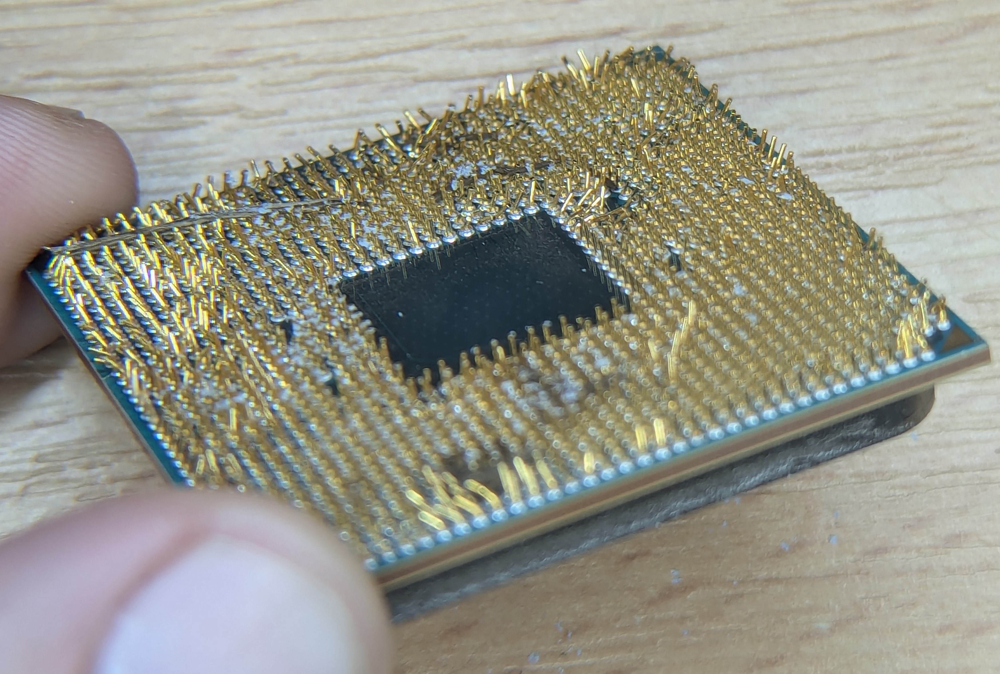

This was the result after around 90 minutes of work (but not the final stage). Not only did the chip work fully, it ended up in a machine that now has a new owner. Reuse is always better than recycle.

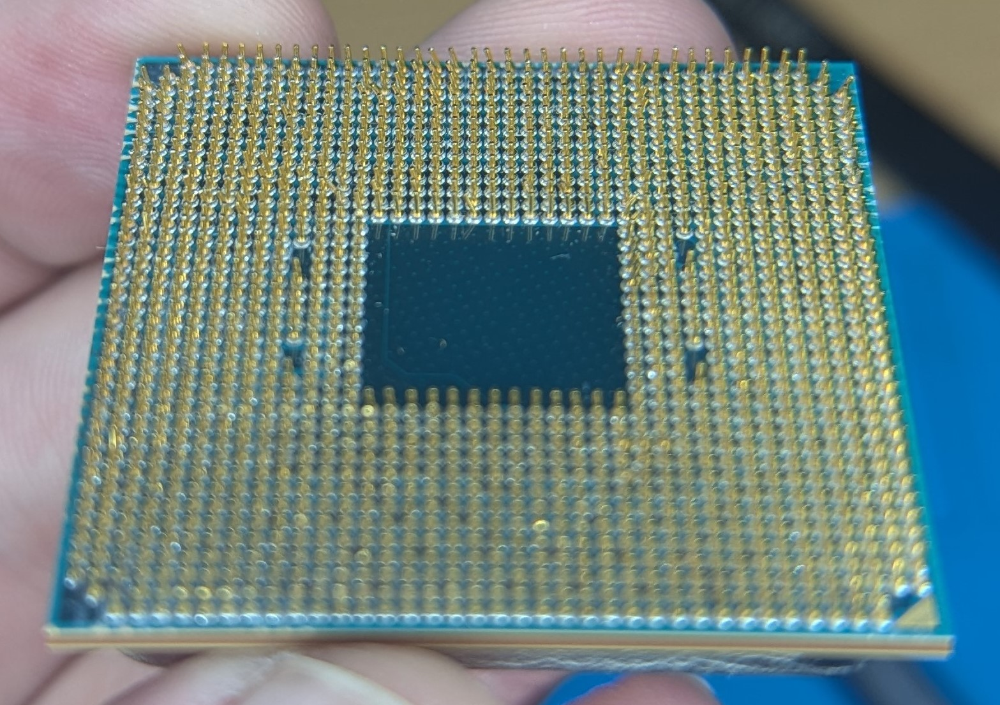

After I initially posted this on social media, many people didn't believe me and felt this was an impossible task. This guide highlights the exact process I took. You can decide for yourself.

Hopefully you'll never have to deal with something quite this bad, but the underlying principles and techniques are the same if you are dealing with 1 pin or 1331.

## The Tools

Although I have a preference, I'm trying to present a few options here, with at least one in each category that you will likely have at home already at zero cost. For the rest, I've provided Amazon referral links but don't feel this is something you can't tackle without spending money.

### Something to see with

You can't fix what you can't see. If you are working on pre-Pentium 4 era processors such as those on Socket 7, 370 and 462, the pins are much larger and spaced further apart, so you can likely get away with the naked eye.

For everything else, I find magnification is essential. Even if your eyes are young and fresh, magnification is still going to make your life *easier*. Who doesn't want an easier life?

Here are some good options:

 - [Reading Glasses](http://www.amazon.co.uk/dp/B01KW9ZKUI/ref=nosim?tag=spodesabode-21)
    - Even if you don't need them for reading, these will still provide a level of magnification that might make all the difference. They are also cheap, often sold in pound shops, or easy to borrow from someone.
 - [Headband Magnifier](http://www.amazon.co.uk/dp/B08DTC152L/ref=nosim?tag=spodesabode-21)
    - Comes with multiple magnifications, with the added bonus of moving with your head and not needing to be mounted in a fixed place. They usually have built in lights too.
 - [Magnifying Lens on Arm](http://www.amazon.co.uk/dp/B0DM1ZZ9YG/ref=nosim?tag=spodesabode-21)
    - Often sold for people doing jewellery or Warhammer models, so easy to find.
    - Usually a fixed magnification and often have lights.
 - Mobile Phone
    - A lot of mobile phones can zoom in quite far and will autofocus as you move the CPU around. Stick it in a tripod/mount, and you can use it in a very similar way to a mounted magnifying lens.
    - If desperate you can even take photos and then zoom in and look at the photos to identify where you need to work next and this wouldn't require a tripod.
 
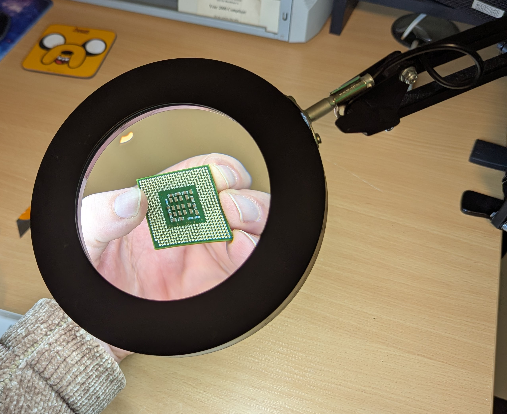
*This was a gift from my friend Josh - I find it very useful, more so than my digital microscope.*

>This is my preference - a magnifying lens with a ring light on a sprung loaded arm. I can leave it where it is and just move the CPU around under the lens and the extra light really helps.

### Something to move individual pins

Different scenarios require different approaches, so it's worth having a few options available, so you can see what works best for each given pin.

 - Retractable Pencil
    - Often recommended but rarely ideal for modern CPUs. The fit is usually too loose and can affect surrounding pins. Worth trying if you have one, but don't buy specifically for this.
 - Tooth Pick
    - Effectively free, these are great for getting in under pins that have been bent flat, without being concerned about causing damage to anything. The pick will snap before a pin does. You can also use them to gently nudge pins back into place if you have the patience.
 - [Ceramic Tweezers](https://www.amazon.co.uk/dp/B092M72ZPG/ref=nosim?tag=spodesabode-21)
    - Unlike normal tweezers that only contact at the tip, ceramic tweezers tend to close flat across the whole tip section, which is ideal for gripping and flattening the entire pin.
 - [Desoldering Needles](https://www.amazon.co.uk/dp/B07QM818TD/ref=nosim?tag=spodesabode-21)
    - Originally designed for desoldering, this kit comes with multiple sizes for different pins/legs for a snug fit.

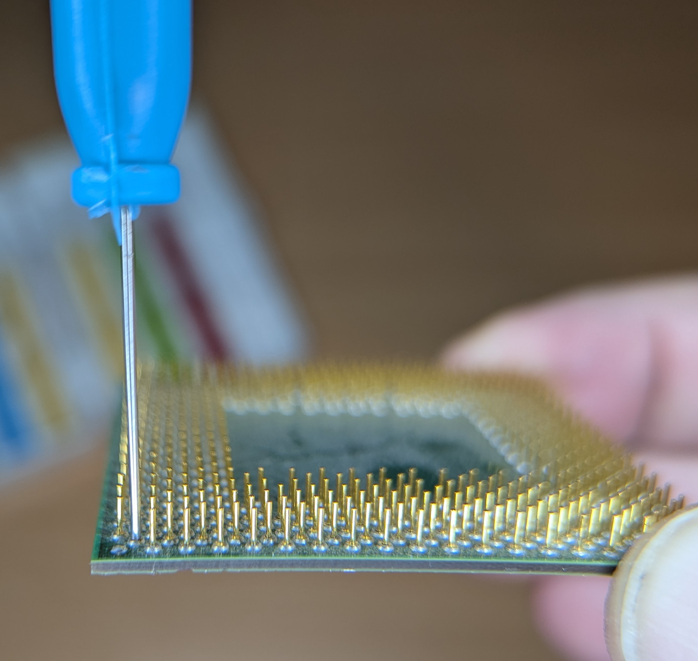
*Desoldering needle in action, perfectly fitting over the pin on this Athlon XP.*

I originally bought these needles to use for desoldering _(don't bother...)_ and by pure chance, they have been an absolute game changer for handling CPU pins. They are thin enough that you can come in at some awkward angles and still manage to bend the pin back. They have a snug fit so when the needle is perpendicular to the CPU, you can be pretty sure it's straight.

>I find desoldering needles so effective for handling CPU pins, that if you are working on an expensive CPU, I would genuinely suggest buying these for the task - nothing else I've tried comes close.

### Something for adjusting an entire row of pins

 - [Stanley Knife Blade](http://www.amazon.co.uk/dp/B003NLXKOQ/ref=nosim?tag=spodesabode-21)
    - They are strong whilst also being very thin. 
    - Pretty much CPU size.
    - The trapezoid tapered ends double it up to almost work like a plough.  
 - [Razor Blade](http://www.amazon.co.uk/dp/B0BW14PCMP/ref=nosim?tag=spodesabode-21)
   - Should work similarly to a stanley knife blade, but won't have the taper.
 
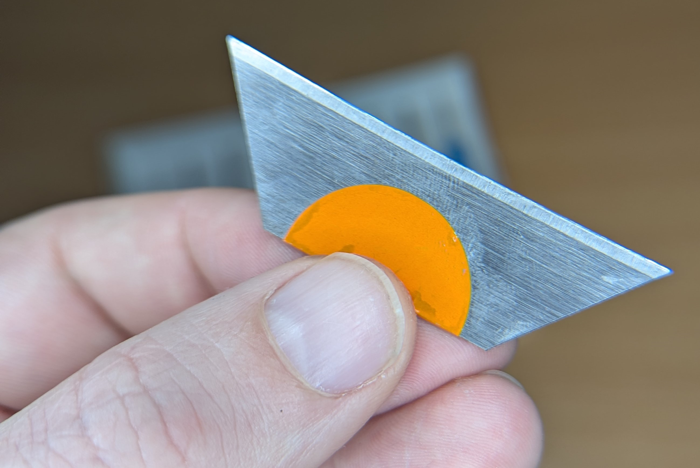
*Pretty standard utility knife blade in the UK.*

Outside the UK, these go under different names, but I'm sure you can find your local equivalent. I put a sticker over the notches just to make it a little more comfortable to hold. I usually use a blunt/used blade, as long as it doesn't have any physical damage to the edge.

>Realistically anything longer the CPU that is thin enough to get in-between the pins will work, but my experience is that knife blades _(**not** in a knife)_ like mine are ideal and commonplace. I wouldn't waste time trying to find an alternative.

## Before You Start Bending

>Processors are susceptible to static discharge, so ensure proper precautions are taken.

### Assess the damage

Before you start any work, you really need to see what you are dealing with. Depending on how your CPU got damaged, there could be trapped debris (hair, dust, fluff, thermal paste etc.). Not only can it make it hard to see, you don't want to be introducing dirt into your CPU socket when everything is done. 

I usually use some [contact cleaner](http://www.amazon.co.uk/dp/B006UCJ5WQ/ref=nosim?tag=spodesabode-21) or IPA _(isopropyl alcohol, ideally 99.9%)_ and give it a gentle clean with a soft brush. Just try and make sure you don't make your situation any worse.

Looking at the CPU top down will only reveal pins that are significantly bent / flat. You want to primarily be looking at it from the side, like you are peering through an orchard. Scan the whole row left to right, looking down the column for any out of place pins. Then rotate the chip 90 degrees and scan the rows again as it could be bent on a different axis.

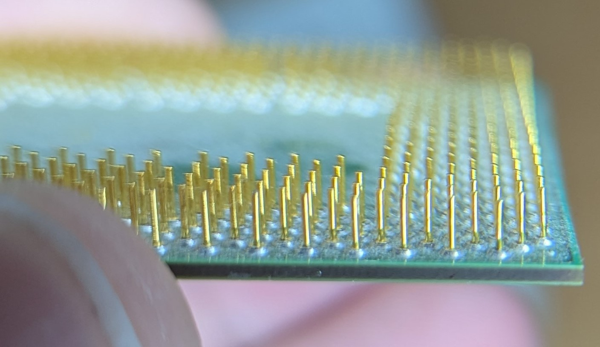
*Peering through the orchard is hard to capture!*

You may see some of the following:

- Crooked / misaligned / bent pins
   - These are still straight, but have bent at the base to create a different angle.
- Kinked / squashed pins
   - In some cases you will end up with pins that are more C/S shaped.
- Curved pins
   - Usually when someone removes a CPU from a socket in an uneven manner and typically at the edges.
- Flat, bent over pins
   - Usually solvable, but you'll need to be careful they don't snap.
- Snapped pins
   - These won't be fixable without soldering, but if there is any pin remaining, you'll still need to bend it back
- Missing pins
   - If the pin is missing, but you can still see solder - this might be repairable, if needed
- Solder pad holes
   - If you can see where the pin should go, but there's no solder or metal but instead a circle of substrate, the pin has likely ripped the pad off
   - By most peoples standards, this is unfixable, but again might not be an issue

I don't intend to cover replacing pins in this guide _(for now)_. But I will say that unless they are on an edge, they are extremely hard to work with.

### Can you get away with missing pins?

If you have snapped or missing pins, you may think it's game over - but not always. You will want to look up the pinout for your socket and see what they are used for. If they are NC (not connected), GND (ground) or RSVD (reserved) you may well get away with them being missing.

For CPUs where the memory controller is integrated in the processor (anything Athlon 64 and newer) then many of the pins are used for exactly this. If there are pins missing, you may find the CPU will still work, but you might lose one channel of memory. 

This means, for example, if you have a motherboard with four memory slots, you will only have two that will work, reducing your maximum memory capacity and losing dual channel memory support. This becomes more problematic if your board only has two slots.

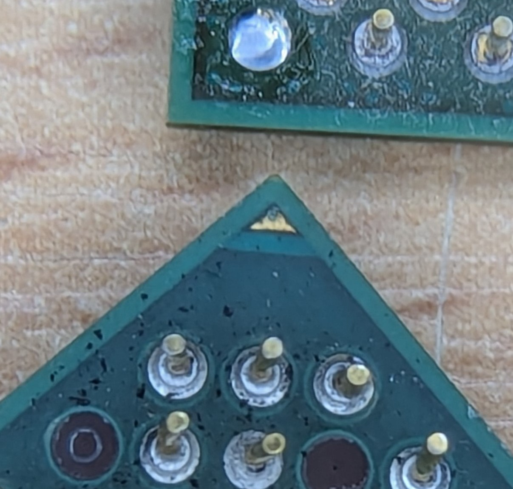
*Pins with missing pads (bottom) and cleanly removed pin (top)*

In my experience, if the missing pins are crucial, the system just won't boot. An argument could be made that a missing ground pin could mean power flowing through an undesirable path that could have negative side effects, but this would likely result in unstable behaviour that would be caught during testing.

>If you have missing pins as well as bent pins, you do have to ask if it's worth continuing at this point. However, if you have time on your hands... why not?

## The Technique

Like solving a Rubik's Cube, success comes from following a systematic method. While I've broken this down into stages, you'll likely move between them as needed.

### Stage one - individual pins

The vast majority of pins will be resolved with the knife blade in stage two, which means the goal of the first stage is getting the CPU to the point that you can easily run a knife blade down each row.

Gold is a very soft metal, so you don't need to heat the pins first - you would just end up with a hot CPU that's hard to hold.

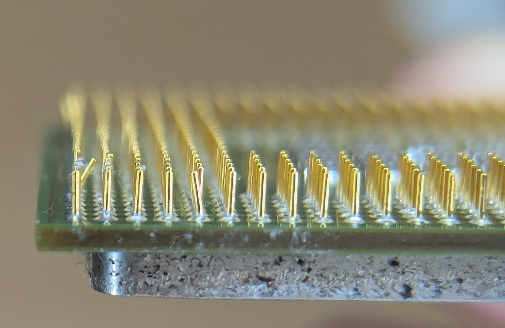
*When looking down a row of pins, misaligned ones stand out clearly against their neighbours.*

Whatever tool you've chosen, we are first going to look for any that are flat, or contacting other pins. Often pins are damaged in a cluster, and you will need to resolve the surrounding pins before you can get to the damaged one.

In some extreme cases, I have intentionally bent surrounding pins by a small amount, in order to gain access to the worst off pin.

If you are using a tooth pick, the end of a knife blade or any other similar tool - we are just trying to lift the pins off the surface, so that you can get your pencil, tweezers or other tool over the pin to put it into a proper position. 

If you have the desoldering needles, it's thin enough that you may be able to just get straight in there. Slide the needle over the pin and gently bend it back to a straight position.

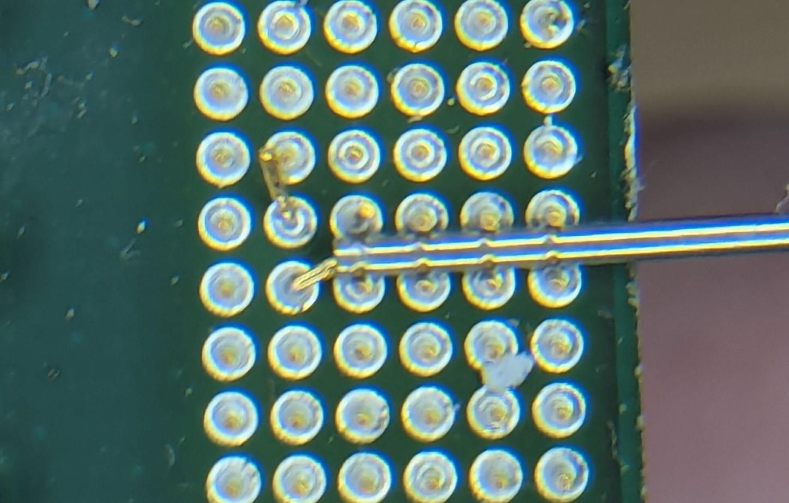
*This pin is flat to the CPU, but the desoldering needle (slightly larger diameter) was able to get in there and lift it back to straight.*

>If damage is already done, the best technique in the world isn't going to change the fact that a pin might snap as you bend it back. Use gentle pressure - better to under than over adjust. Avoid bending pins back and forth as this causes metal fatigue and leads to snapping.

Curved and kinked pins are the hardest to take care of and come with a great risk of snapping due to the amount of bending involved. You may want to temper expectations on how good you will get these as a slightly kinked pin is better than a missing one. Even when kinked you can often still get them into a socket, albeit not with the full "zero" insertion force.

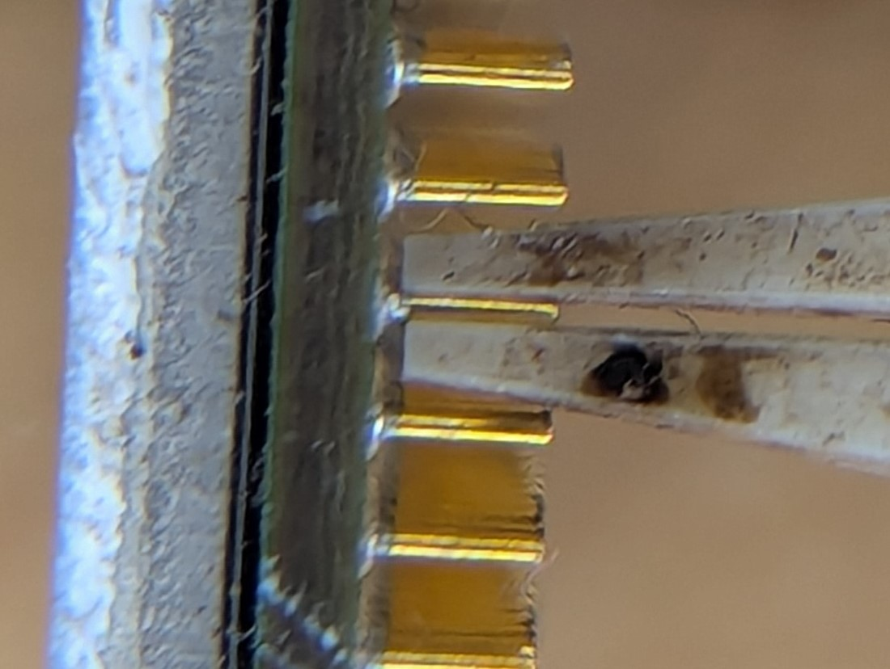
*I didn't have an example of a kinked pin, but you can see how these ceramic tweezers would help squash it flat.*

My preferred method is to use a pair of ceramic tweezers due to the increased contact area. I squeeze the pin, rotate and squeeze again and keep going until it looks straight enough. I find this is much less likely to snap as there's no real bending involved, just squashing.

### Stage two - row by row

Once you have found bad pins, take your knife blade and slide it through the affected row until the blade comes through on the other side of the row. Be careful as you do this - the trapezoid shape of the blade will act like a plough and move any severely misaligned pins to one side as you slide through. If you hit friction, stop and go back to stage one.

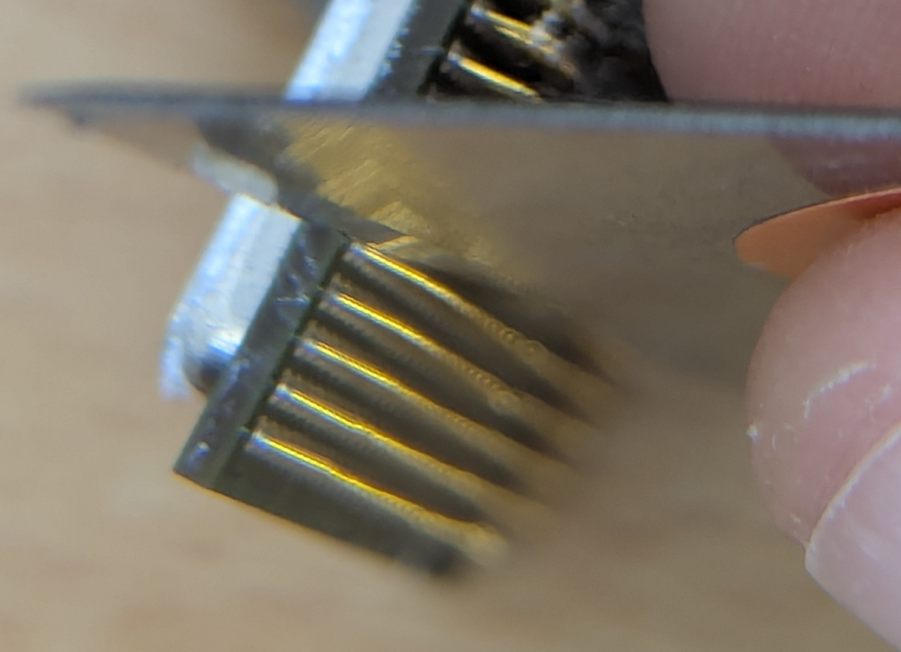
*The blade sitting against the base of the pins at a slight angle.*

With the edge of the blade at the base of the pins and the CPU held firmly, apply gentle pressure while bringing the blade to a perpendicular position. Any out of place pins should follow suit.

Next, move the blade to the other side of the row and repeat the process in the opposite direction. This will correct any overshooting from the first pass, while also aligning pins that need adjustment in that direction.

Rarely is a pin off in only one axis, so after this, your bad pins could still look wrong - that's normal. Rotate the CPU by 90 degrees and do the same steps through the next axis. Repeat until it looks straight.

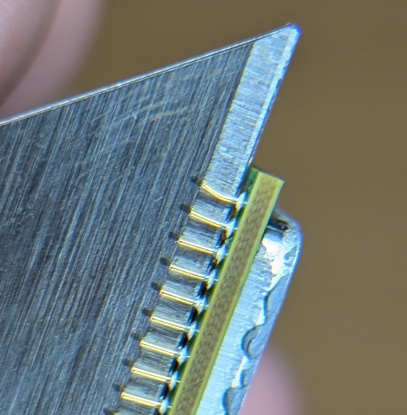
*The blade also provides good background contrast for looking at pins. This has only been corrected across one axis.*

For badly damaged CPUs, work systematically - complete all rows in one direction before rotating 90 degrees and repeating. For just a few bent pins, you can be more targeted.

>I tend to tackle the outside rows *last* as when you are handling the CPU, the chances of you bending some of those outer pins is quite high.

### Stage three - the socket as a guide

CPU sockets are somewhat forgiving and if done correctly, this final stage of putting the CPU in the socket will take care of any remaining minor misalignment. 

Processors are keyed to only fit in one orientation - so make sure it's correct. This is usually indicated by a triangle in one corner of the CPU to match a corresponding triangle on the socket. I have seen very experienced people forget this and try and put a CPU in the wrong way around. You are not immune, it's an easy mistake to make.

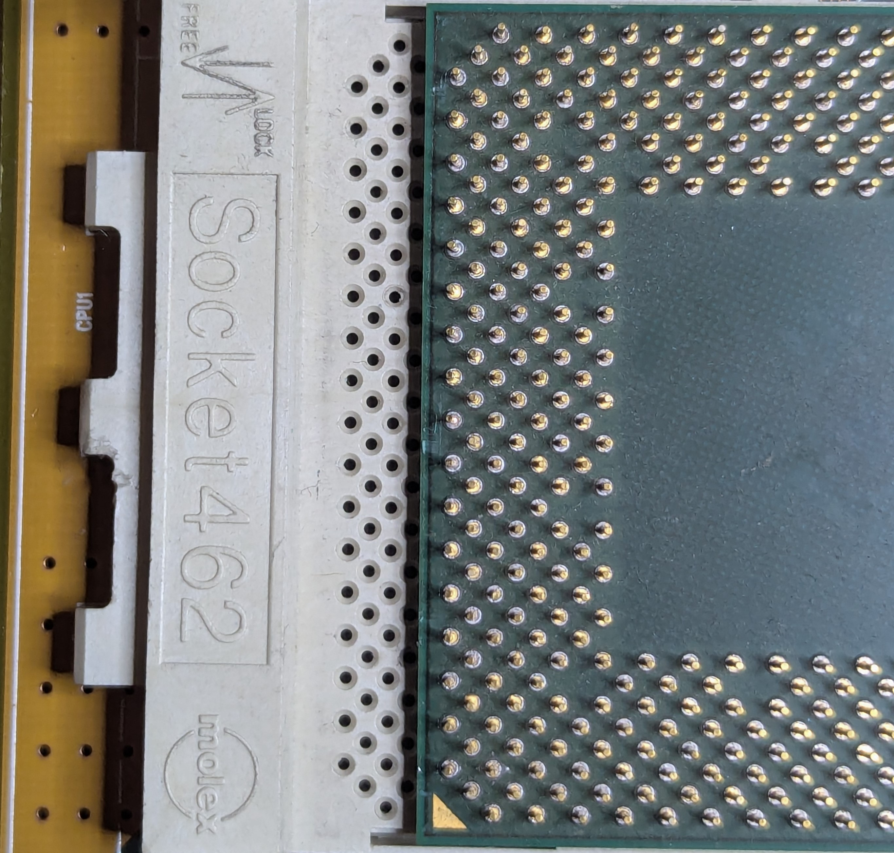
*This socket doesn't have a triangle, but if we flip the CPU over we can see there is only one possible orientation.*

If you are extremely lucky, your CPU should pop back in as intended - but chances are, this won't be the case and there will still be some pins causing you issues.

>*Never* force the CPU in. 

If you've re-inspected the chip and it looks good, then a _small_ amount of pressure on to the middle of the CPU may well be enough to pop it in. If you feel a strong resistance, just stop - you've probably missed something.

The gentle pressure also has a habit of finding the pins that aren't aligned and then making them slightly *more* misaligned, which makes them easy to spot. This is a risky area though as it doesn't take much for it to just flatten entirely. Unless you want to undo all your hard work - just take the time to inspect it again.

If you still aren't having any luck - the next step is to go in one corner at a time. Put the CPU on flat as normal, but instead of putting some pressure in the middle - start with one of the corners. If that goes in, try another corner.

Sometimes going a corner, or an edge at a time is all that is needed to get it into the socket, but other times you'll find a spot on the CPU that refuses to go in, and it almost rocks/pivots at this point. Remove the CPU and look at that problem area - you'll soon see which pins need working on.

>Once the CPU is in the socket, I like to open and close the socket lever a few times, and then I *remove the CPU again*. 

There are a few reasons for this - one is that removing and reinserting it a few times will make sure everything is aligned correctly, but importantly - you really want to be certain you haven't accidentally pushed over a pin flat.

I've seen multiple instances where the CPU *looks* in and flat, but a pin has folded over and shorted against other pins. If it had been turned on, it could have cooked itself, or worse the board.

So remove it and double-check your work. At this point, I tend to spray a little contact cleaner into the socket as well as on to the CPU, before reinserting.

### Stage four - test it

At this point, your CPU is in, and you should test it like you would any CPU (especially of unknown origin). As most CPUs have the memory controller integrated - my go-to first step is MemTest. If there's an issue, it'll manifest here.

If it passes this (ideally running the extended test which uses all cores) then you could move to some benchmarks inside an operating system such as CineBench or OCCT.

## Good Luck!

Even with patience, the right tools and a systematic approach, luck still needs to be on your side. Take pleasure in the process, then even the failures are still a success. Enjoy!