I've serviced and sold easily one hundred drives, and unless there was obvious physical damage, I can't think of a single one that the process in this guide didn't bring back to full working order.

If you'd rather not buy a drive that I've already serviced, this is my guide to getting your existing drive - or another one you've sourced - back to working order.

This guide is targeted at 3.5" PC drives, but the principle can be applied to most 3.5" drives (including laptops and Amigas), with the exception of Macs with auto-eject mechanisms, which need additional work not covered here.

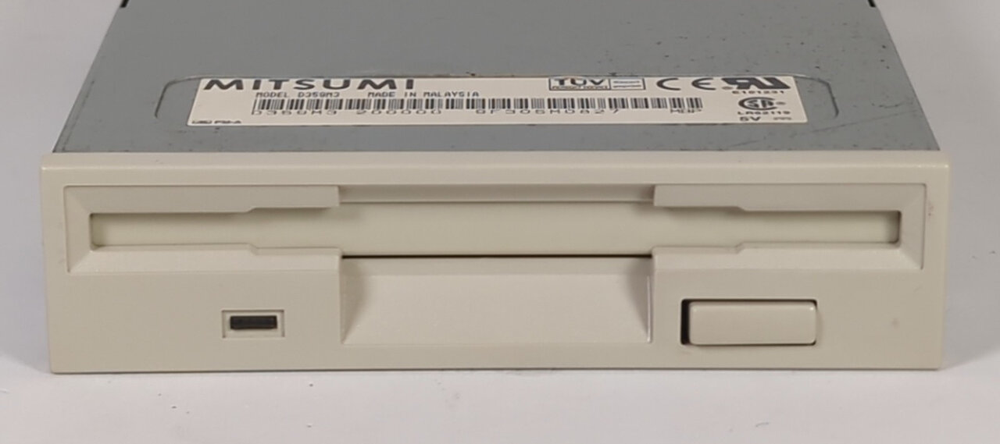
*If this is a familiar sight to you, pop an ibuprofen and go and get your reading glasses.*

## The Plan

If you don't want to dismantle your machine, you may have some luck simply blowing the dust out and using a dedicated head cleaning floppy (if you can find or make one). But in most cases the guide rail is the bigger problem, and a head cleaner won't touch it, so it's best to open the drive up.

We're going to dismantle the drive, clean it, clean the heads, and clean and lubricate the guide rail. Then, if needed, we'll re-grease the worm drive and head plate, and check and clean the track 0 sensor and the sensor switches.

## The Tools

You don't need much. The essentials are **cotton buds**, **isopropyl alcohol (IPA)**, **sewing machine oil** and a thin tool for prising things apart, such as a **spudger**, **flat head screwdriver** or **old credit card**.

You might also need: a small **Phillips screwdriver**, a **soft cloth**, **window cleaner**, a **paint brush**, a **toothbrush**, **Cif** (or similar cream cleaner), a **magic eraser**, **contact cleaner** and some light **grease**.

Try to get IPA that is 99% pure. The common 70% mix is 30% water, which dries more slowly and isn't something you want sitting on bare metal or a circuit board.

Sewing machine oil is ideal because it's thin and light, but a clock or watch oil will also do. Avoid anything thick.

## Why Calibration Is Probably Not the Answer

I often hear people say "oh, it must need recalibrating" when a floppy drive is misbehaving. Most drives fail with erratic read and write issues, and these are usually caused by dirty heads or a dirty guide rail.

A drive that really is out of calibration can be hard to spot, because it will seem to work correctly with disks made on that same drive. The giveaway is that it won't read disks made on other drives, and those drives can't read its disks. It's a consistent fault, not an intermittent one.

It *is* possible to recalibrate some (not all) 3.5" drives, but it's a very complex process. If your drive was made after ~2000, it typically has a fixed track 0 sensor, and after factory calibration everything is glued in place, making it almost impossible for the drive to drift or to be recalibrated. I've never had a drive that needed it.

## Step 1 - Clean the Outside

We start by cleaning the outside of the drive to minimise the dirt getting in when we open it. Plus it's no fun handling something dirty. Yours might not look like this, or it might look worse.

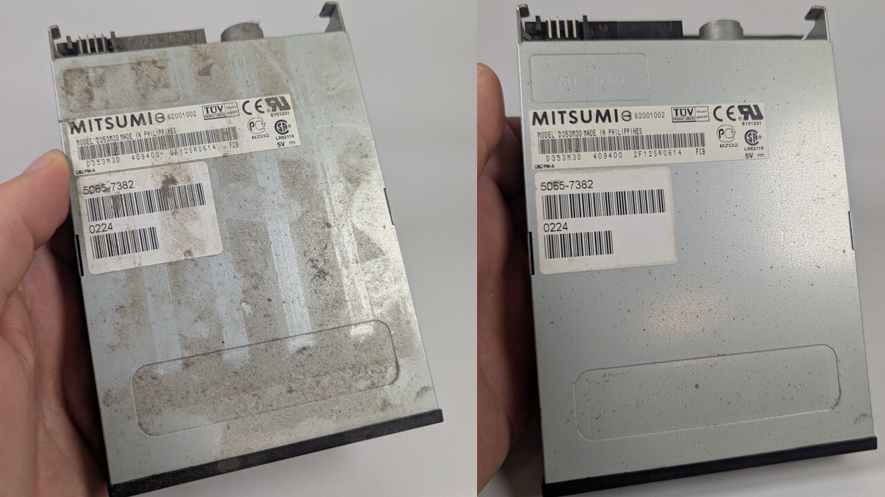
*Before on the left, after on the right.*

The nice thing about the metal casing is that it acts a bit sacrificially. Corrosion will typically hit here first, leaving the inner drive intact. As you can see, I have some light pitting on this drive.

I usually get the worst off with a dry paint brush, and then clean it with a cloth and some window cleaner. I like window cleaner because it's a good general cleaner, and it removes musty smells too.

## Step 2 - Open It Up

How the drive comes apart varies from model to model, so don't force anything - I'm sure you'll work it out. In most cases there are 4 tabs that need releasing with a spudger, and that's it.

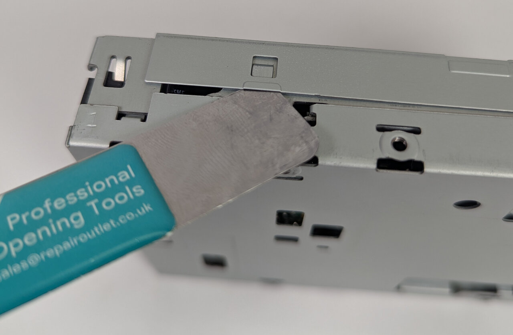
*Releasing one of the case tabs.*

Sometimes there is a single screw at the back stopping you from lifting the case off, and sometimes there are one or two screws on the top. In my experience, if a drive has screws, the case often slides off rather than needing a spudger - but that's not always the case.

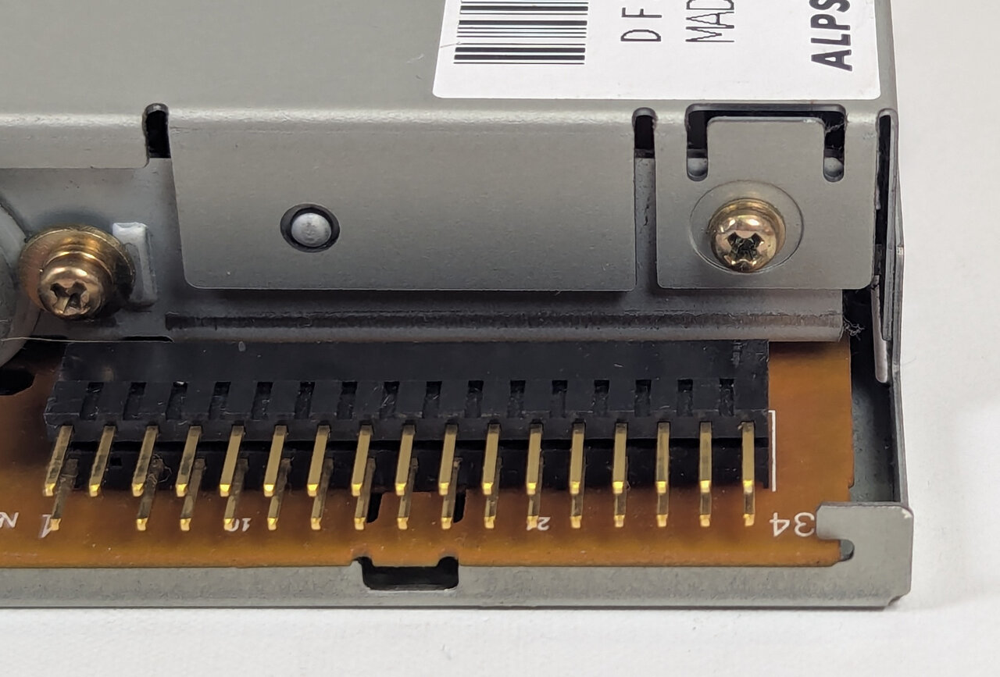
*The screw at the back of this Alps drive needs to come out before the case will lift off. Note the pins - we'll come back to those.*

## Step 3 - Check for Physical Damage

Before cleaning the inside, take a good look at the drive now that it's open. I've only had a handful of drives that I couldn't get working, and in those instances it was either severe corrosion or physical damage, like the head having fallen off.

Children also like to poke things into floppy drives. I've had some with floppy disks jammed in upside down, a mini-CD pushed inside, and toys. If you don't know the origin of your drive, it's definitely worth looking out for these kinds of issues - and it's why you should always test with disks you don't mind losing (more on that below).

### Bent Pins

Also look at the pins on the back of the drive. A common fault is people yanking the cable off, leaving the pins splayed out to the side.

If it's a nice clean bend, just put the cable back on in the direction it was pulled off. Otherwise, I use a desoldering needle (as shown in my [bent CPU pins article](/articles/handling-bent-cpu-pins/)) to bring them mostly back into alignment, and then let the cable block do the rest.

These larger pins are far more robust and forgiving than CPU pins - even a pair of pliers can become an appropriate tool.

## Step 4 - Remove the Bezel

In most cases you do not need to remove the plastics to get the case off, so I'd leave them until now. With the case off, you can see exactly how the front bezel (also known as the fascia or faceplate) is held on.

Usually it's 4 rather delicate plastic tabs that you push in so the bezel can slide off. These *can* get brittle, so if you're concerned, just leave it in place and clean it *in situ*.

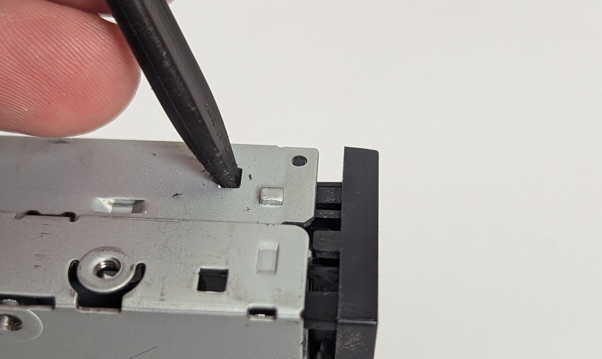
*Pushing on the tabs to release the front bezel.*

On some drives, like this Panasonic, there are two screws holding the bezel on instead.

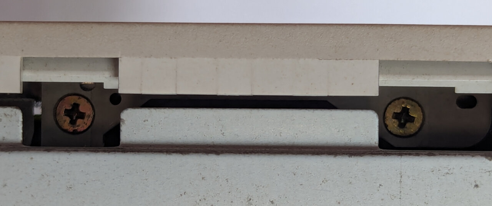
*Two screws hold the bezel on this Panasonic.*

Some drives have the flap and spring attached to the plastic, so they come away with the bezel.

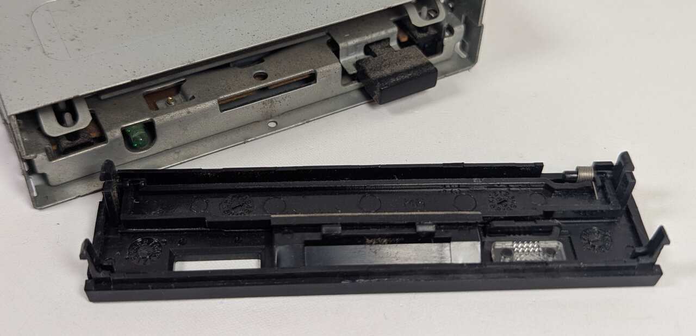
*The flap and its spring come away with the bezel on this one.*

On others, the bezel is separate and the flap and spring are part of the drive itself.

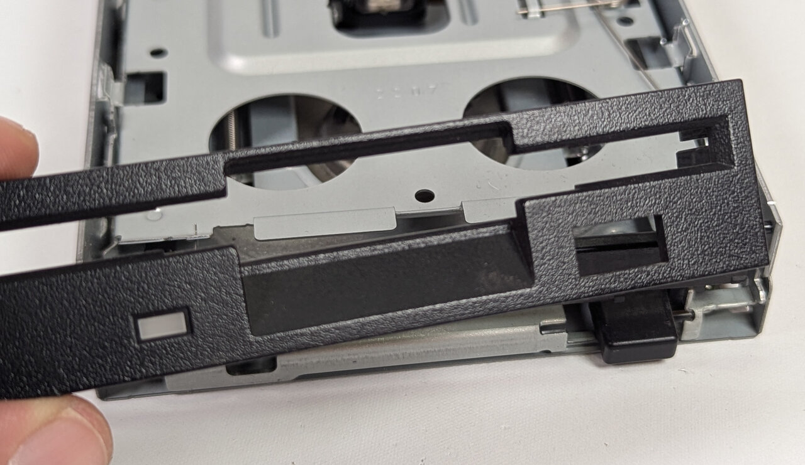
*Here the bezel lifts off on its own.*

I wouldn't recommend removing the flap and spring. The springs are very easy to lose, so just clean them in place with a cotton bud, which will go right into the corners.

The eject button usually slides off, although sometimes you have to lever it up with a spudger. I normally clean it in place. If you want to retrobright it ([see my article on how](/articles/non-invasive-retrobrighting-with-peroxide-vapour/)) then you'll obviously need to take it off.

## Step 5 - Clean the Drive

Now for the actual cleaning, starting with the bezel and then moving on to the drive itself.

### Cleaning the Bezel

I usually hold the bezel in a cloth, spray it with window cleaner, clean it with a paint brush and then wipe it dry with the cloth. The brush agitates the dirt and gets into all the corners that a cloth alone can't reach. In most cases that's enough.

If you have some mild yellowing, I find cleaning it in the sink with a little Cif and a toothbrush will lighten it a little. The toothbrush is a bit firmer than a paint brush, which helps.

Sometimes you'll find other marks - pen, or random black bits. IPA will usually bring these off, otherwise a few light strokes with a magic eraser will do the job.

If there is physical damage to the plastic, such as a dent or scuff, it can be worth running a knife blade parallel to it to remove the burrs. This will often minimise the damage to the point where you can't really see it. Proceed with caution.

### Dusting the Drive

I usually use a dry paint brush and some air to remove the dust, but I'm very gentle.

### The Heads

There is one head on each side of the disk - a bottom head, and a top head that sits on a spring-loaded arm. Because it's spring-loaded, you can safely lift the top head assembly to get access to both heads.

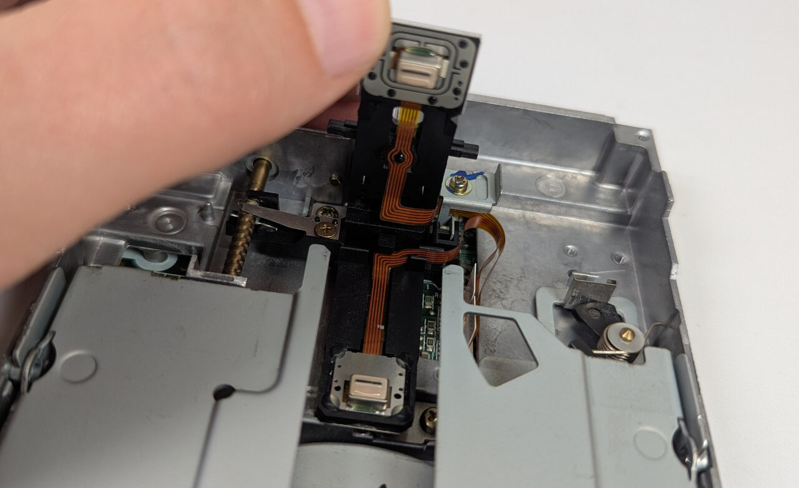
*The top head lifted right up, showing both heads. Most drives don't open this much.*

Most drives only open by 10-20mm, but for some reason the drive pictured here allowed the arm to open fully, so I used it for photography so you can see the heads. I do **not** recommend doing this - just open it enough so that you can get a cotton bud in there.

Then, put some IPA on a cotton bud and gently wipe the surface of both the bottom and top heads. Do not push firmly, and make sure no strands of cotton are left behind.

### The Guide Rail

This is the big one. The head assembly (often called the sled or carriage) slides along a thin metal rod, the guide rail, to the left or right of the head. It's driven by the worm drive (also called the lead screw). In my experience the rail is the biggest cause of problems. If it gets dirty, the head won't move smoothly and won't end up in the correct position, causing errors.

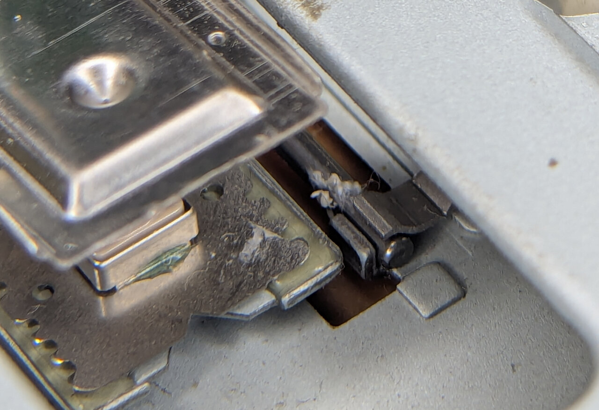
*Dirt build-up at the end of the rail on this drive would likely have caused issues accessing the inside portion of the disk.*

I clean it first using IPA on a cotton bud. Then I put a small amount of sewing machine oil on a fresh cotton bud and gently wipe the surface of the rail.

**Don't apply oil directly to the rail** - it's too easy to use too much and drip it everywhere. You really don't want much on there, as it can attract dust and clump up in the future. A little on the cotton bud, wiped across the rail, is plenty.

Once I've done the front of the rail, I use my finger to turn the worm drive. This moves the head all the way to the front so you can access the back of the rail, and I do the same again.

Some drives allow you to lift the head and move it manually, but at the risk of forcing something, I would recommend simply turning the worm drive.

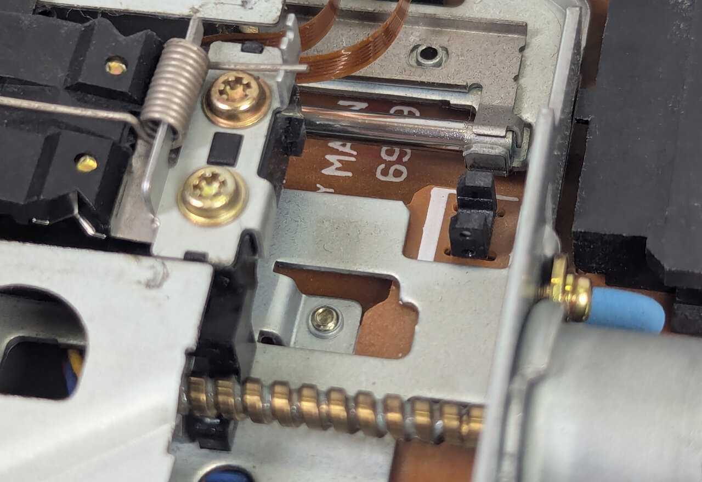
*The back of the rail, with the worm drive along the bottom. A little spin between your fingers is all it takes to move the head forward.*

I like to leave the head in this position. When I plug the drive in, the first thing it does is wind the head back to track 0, and I can hear and see whether it's moving smoothly.

If your BIOS has a "Floppy Drive Seek" option, it's worth turning on. It makes the drive go through a similar motion on every boot, which helps stop crud building up on the rail.

While you're turning the worm drive, pay attention to how it feels. You want to feel how smoothly the motor is running, and whether there are any dead spots.

### Track 0 Sensor

While you're in there, you'll see the track 0 sensor. This is typically an optical sensor, where a small piece of plastic blocks the light as the head moves back to say "hey, this is track 0", and the motor knows to stop.

If this stops working, you usually get "head knocking", where the motor loudly keeps going when it should have stopped. It's generally harmless in the short term, but I'm not sure of the long-term effects of this fault - so it's worth trying to correct.

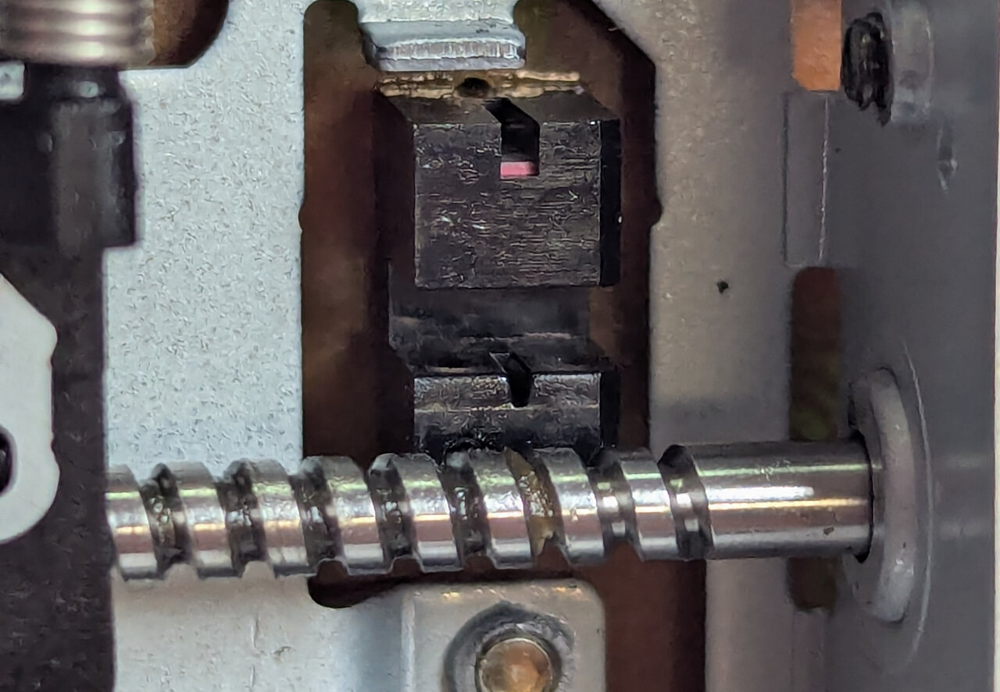
*The track 0 sensor, with the worm drive below.*

If it looks really dirty, or you have been having head knocking issues, squash a cotton bud flat with a pair of pliers before soaking it in IPA, so that it can slide into the gap and remove any debris.

My general experience is that this is seldom at fault, and you can safely leave it alone.

### Other Places to Lubricate

There are two other places you might want to lubricate - the worm drive itself, and the point where the upper head rests against the metal plate. There's usually a small amount of grease here.

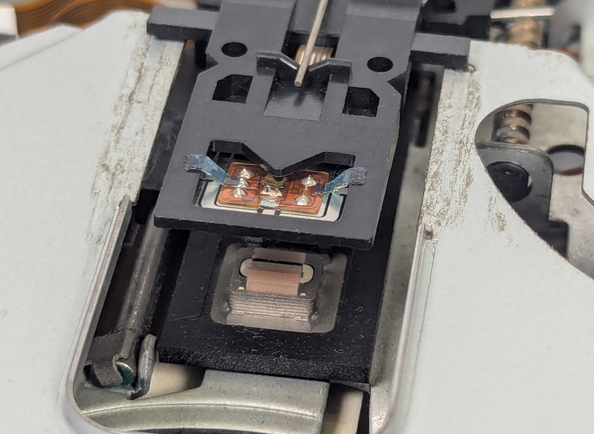
*The original grease on the head plate, on the left and right.*

I usually find the original grease is still working fine. Unless I've had to wipe it off because of excessive dirt, I leave it alone. If you do need to replace it, use a *very* small amount of a light lithium or PTFE based grease.

The worm drive is the same. If it looks dry, or you've had to clean it, put a very small amount of the same grease on the threads with a cotton bud.

### The Sensor Switches

Finally, there are 3 sensor switches at the front of the drive. When you insert a disk, depending on the holes in the disk, it pushes these switches down so the drive knows what to do. One detects the density (the HD hole), one detects write protect, and another detects whether a floppy has been inserted.

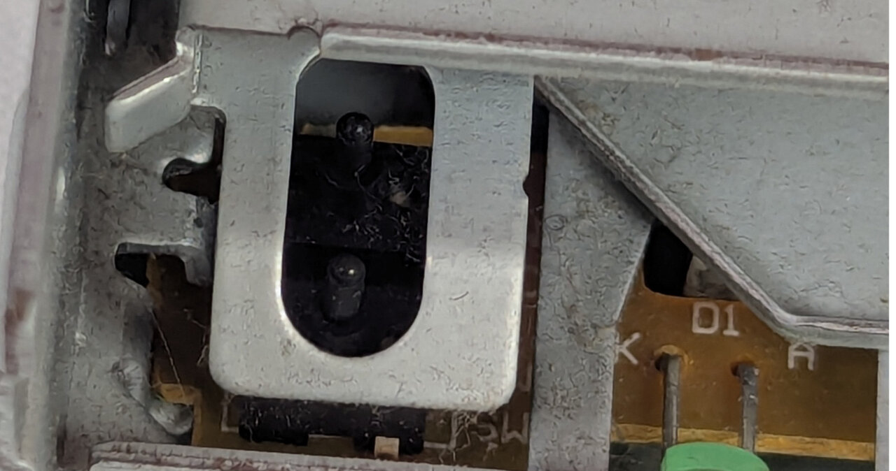
*Two of the switches at the front of the drive. The other is on the right hand side of the drive.*

These *can* wear over time, and I have seen several that fail to detect an inserted disk until the switch is cleaned. Typically I wrap the area in a tissue to catch any excess, then put the nozzle of some contact cleaner right onto each switch and spray. Then I use a cotton bud to exercise the switch by rapidly pressing it. This usually flushes out any dirt and gives us good contact again.

## Testing

Once I've done all this - and *without* reassembling - I test the drive. I like to test it disassembled so I can see what the head is doing during reads and writes, and so I can hear things better.

**Always use disks you don't care about for testing.** If you've missed some physical damage - a burr on a head, or something rough inside - the drive can strip the magnetic surface off your disks. Once a disk is damaged like that, there's no fixing it.

### Testing with My Open Source Software

Because I test so many drives, I've written my own software to make quick work of it: [usbfddt](https://github.com/andrewspode/usbfddt). I designed it to work with a 34-pin USB floppy interface, so I can test drives on my modern machine, without needing to keep restarting it.

It reads a reference disk and compares its CRC to a known-good file on disk. Then it formats a disk, writes an image to it, reads it back and compares again. Throughout, I'm listening to the drive and checking for any marginal read errors, as those can mean going back and redoing my work.

The result is that I can be certain the drive can read and write accurately across all sectors, rather than just hoping it can.

It's released as open source on GitHub, so you can read more there and use it yourself. It's Linux only, so you'll need a live distro if you don't run Linux already.

### Testing on a Retro Machine

There are tools that do similar things on DOS and Windows, and if you test drives a lot, I'd encourage you to find something suitable. WinImage and RawWrite would be worth looking at. But you can get pretty confident using only what's built into DOS, Windows 98 or Windows XP, following similar principles.

While you are testing, listen for seek issues - repeated grinding or re-seeking - and pay attention to any error messages you might get. If the drive is unhealthy, you'll soon know about it.

In order, from reading to writing:

 - **Read a disk you know is good.** Boot from it, or copy all its contents to the hard drive. Better still, make a reference copy using a known good drive, then compare the disk against it in the drive under test (tools like `fc` or `comp` may help here).
 - **Scan a disk, including the surface.** In DOS and Windows 98, run `scandisk a: /surface`. In Windows XP, run `chkdsk a: /r`, or right-click the drive, choose Properties, Tools, Check Now, and tick *Scan for and attempt recovery of bad sectors*. This reads every sector rather than just the files.
 - **Format a disk.** Use a full format, not a quick one, as it writes and verifies every track. In Windows, untick *Quick Format*. In DOS, use `format a: /u`.
 - **Copy files to a disk and fill it up.** Then compare them against the originals (again, `fc` or `comp` may help).
 - **Duplicate a disk with `diskcopy`.** Copy a disk to another disk, then check the new disk works correctly. This exercises both reading and writing.
 - **Create a startup disk.** Windows 98 has a built-in tool for this (Control Panel, Add/Remove Programs, Startup Disk). In Windows XP, tick *Create an MS-DOS startup disk* in the format dialog. Either one writes a good number of files, then you can boot from the result.

## Conclusion

If the steps I've outlined don't fix your drive, I think you would be better off buying another. By the time parts like motors start failing, other parts might be failing too, so sourcing hard-to-find parts is no guarantee of a fix.

If the only reason you're trying to repair your drive is that a replacement wouldn't visually match - say yours has yellowed to perfectly match your case - buy another drive of the same model and move your bezel over to it.

I hope this helps, and good luck!
