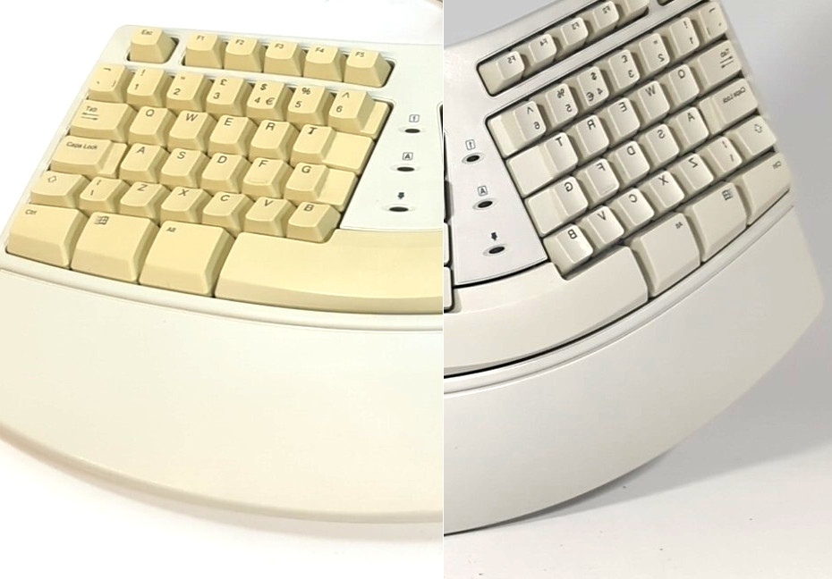
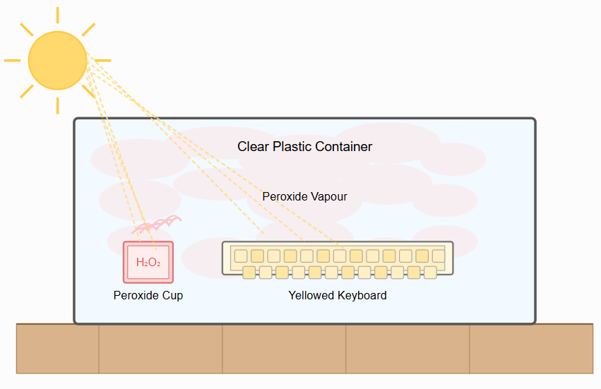
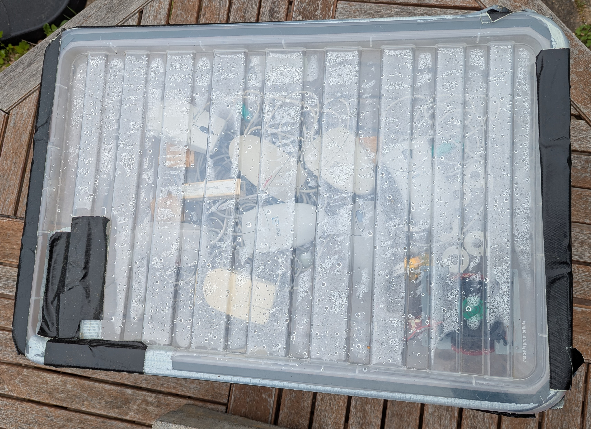
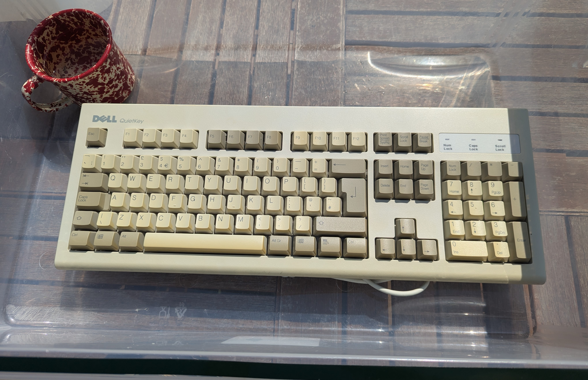
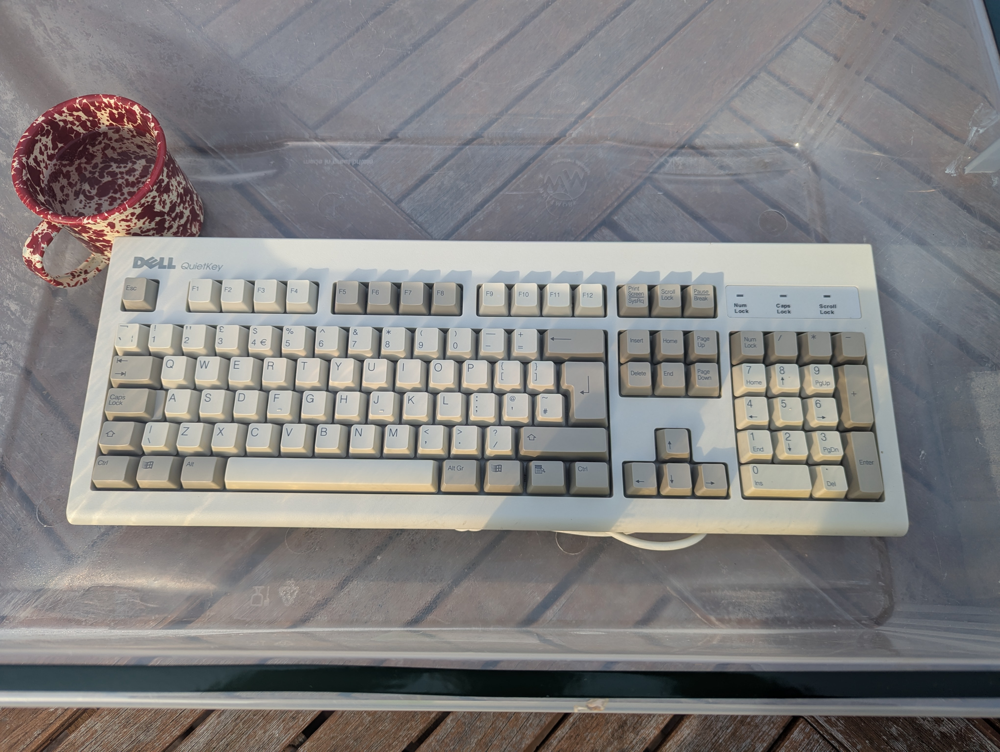
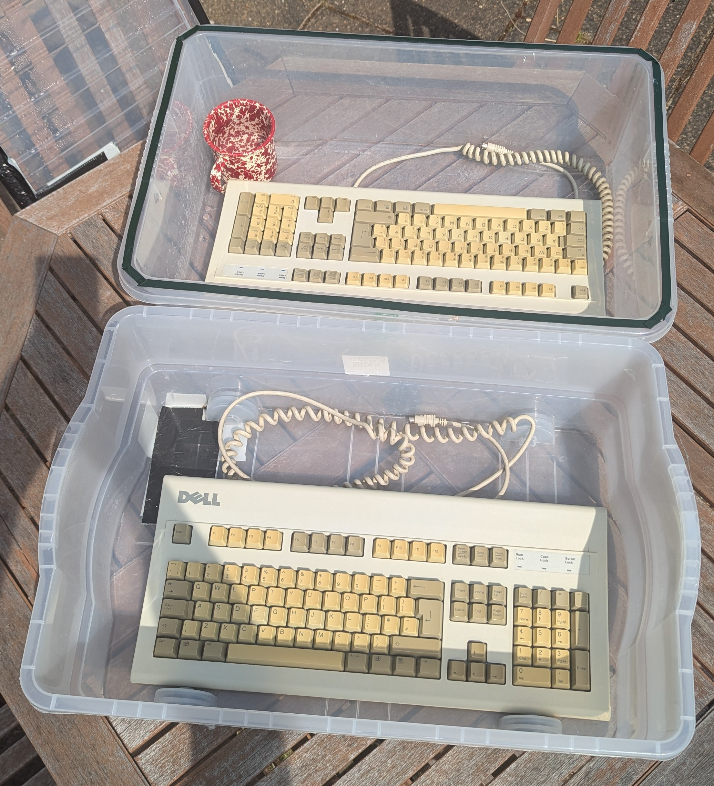
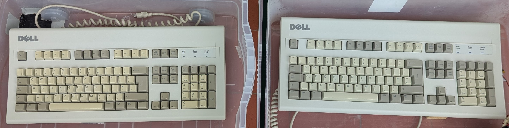
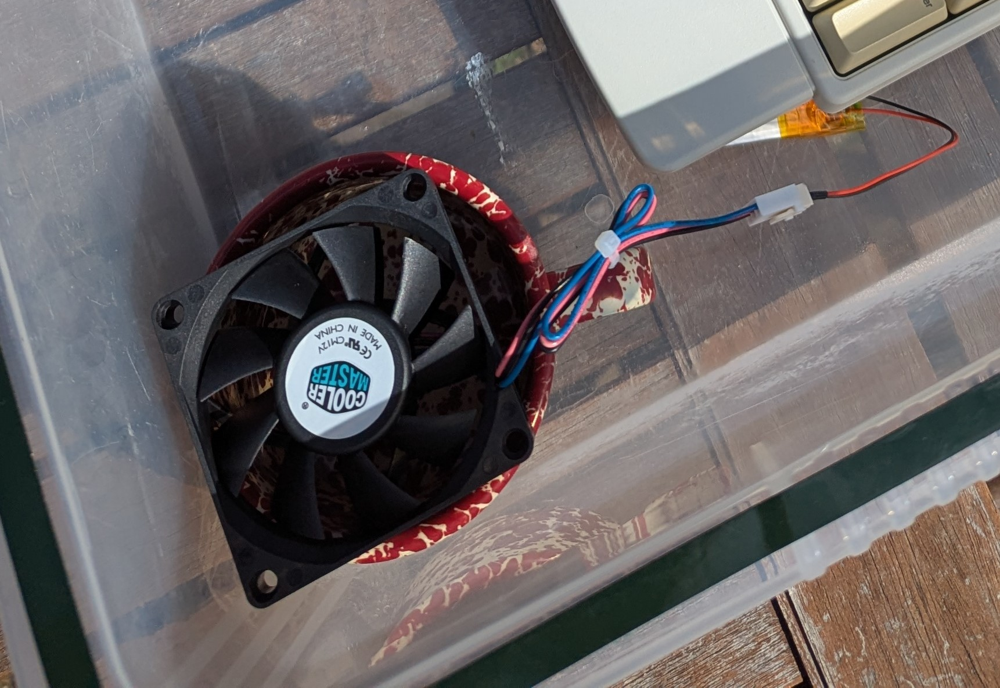
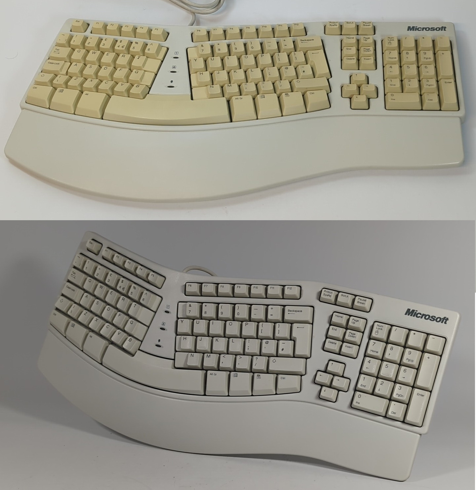
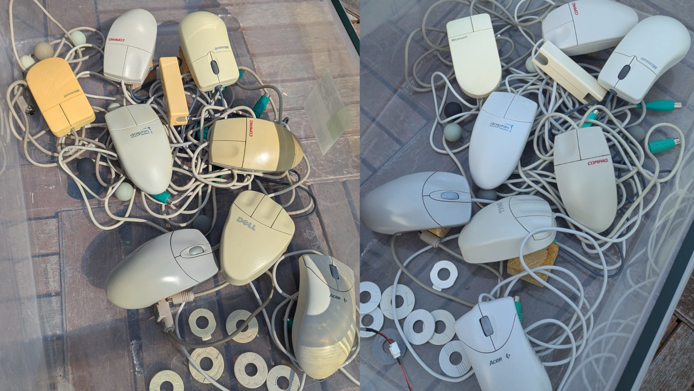

What you see here is the same keyboard, before and after the peroxide vapour treatment that I will be outlining in this article. It used a minimal amount of peroxide, used no special equipment and didn't require dismantling of the device. Importantly, everything still works, and it looks like new!

Retrobrighting, if you haven't heard, is the term coined for restoring the original colour of a now yellowed piece of retro equipment. The most common technique I see in use, typically involves completely dismantling a keyboard, submerging the parts in hydrogen peroxide solution and then using UV lights to control the reaction.

Done correctly it is very effective, but in my experience, it's also very easy to over-brighten, remove logos, or end up with blotchy or inconsistent results. It also requires multiple litres of peroxide to submerge into _(not to mention trying to keep the things submerged in the first place)_. 

Peroxide is not a nice chemical to work with, and the cost quickly adds up if you are doing this regularly. Overall, the risks, time, and money involved, meant I ended up just not bothering and letting my buyers handle it for themselves. However, this usually means the items sell for less, if at all! Who wants to use a yellowed keyboard?

Then I discovered the vapour technique...

## The Technique

The vapour technique is clean and simple - have the item in a sealed container with some peroxide and then expose it to sunlight. The heat gently evaporates the peroxide to create a peroxide vapour chamber. The vapour permeates into the plastic and then reacts with the UV from the sun.

*Please excuse this AI generated diagram.*

Unlike submerging directly into peroxide, this process takes days, not hours and in my experience it's almost impossible to overshoot. 

## The Risks

I've experimented in the past with submerging items directly in peroxide and the electronic components did not react well - however, I imagine being submerged in any liquid for significant time isn't ideal.

I have dismantled mice that I have treated with vapour, and you can see there is a tone difference between the inside and the outside. The vapour appears to only really affect the surfaces directly exposed to the sunlight - even though with the bottom of the mouse open, the vapour could have easily got inside.

As an additional safety test, I placed a GPU with the cooler removed, which has various types of metal, directly in the chamber and fully exposed. After multiple days it looked no different to how it went in - no signs of corrosion, oxidation or other ill effects.

*Of course, there's nothing stopping you from dismantling your item first and eliminating the risk to electronics entirely.* But this would mean switching the risk of treatment with the risk of damage during the dismantling process, which in itself is not negligible. 

But what about the health of the plastic? Fiercely debated, some would say that any form of peroxide treatment is bad for the plastics and can make it brittle. I've not noticed this myself and the water also present in the air (from the evaporated solution, as well as from the reaction) arguably stops the plastic from drying out too much.

Finally, there's the question of long-term effects. Again this is widely disputed and largely formed of anecdotal evidence. I would argue that as this method is far less invasive than submersion - the risks should also be reduced.

**All in all, I would expect that these factors bring minimal risk, which is inline with my own experience.**

## Preparing the Keyboard

The peroxide vapour and UV need direct contact with the surface, so anything that prevents this will reduce effectiveness. The most obvious barrier is dirt and grime, so you will want to clean and dry your keyboard first. 

In most cases you can just use a paint brush and air blaster to remove dust, followed by a damp cloth and then an alcohol wipe for remaining grime. I sometimes wash keyboards (without submersion) but I only tend to do this if the keyboard has significant filth build-up under and around the keys.

Finally, I tend to grab a magic eraser and give it a one-pass wipe over most surfaces - it seems to do a great job of lifting really fine dirt particles.

I then tackle any remaining blemishes with the magic eraser, but of course the usual cautions are advised - it may be a gentle abrasive, but it's still an abrasive and you don't want to end up with loads of smooth spots.

If you have stickers that you want to remove, you also want to remove them now, being sure to remove any residue.

## Making the Chamber

The larger the chamber, the more vapour it's going to need to fill it. I've not experimented to see how much real-world difference it makes, but it seems sensible to me that you don't want the tub *much* bigger than what you are retrobrighting.

I used an under the bed storage tub as it's not much bigger than a keyboard and I happened to have one spare. Mine had some cracks in it - but as a mender, not an ender, I patched it up with some duct tape and the seal was good enough.

There were some factory holes on ends which I also sealed with tape.

*As you can see, this chamber looks ratty as hell - but it works, and I didn't have to spend any money. I'm retrobrighting a selection of mice here - it's not just keyboards you know!*

Next, I used some self-adhesive foam strips all around the rim. Being slightly raised, the lid naturally sits on it creating a seal. I did experiment with placing bricks on the lid to improve the seal but didn't find it made any noticeable difference other than casting a shadow.

Here I have added a keyboard and what you can't see is that I raised it off the bottom using a few wooden blocks. I felt that this would help ensure even coverage. Often just resting it on the cable is enough. This also protects you against rain leaking in, or the cup falling over - there's no chance of sitting in a pool.

The cup in the corner is an enamel camping cup - I figured it would hold the heat well, but honestly I imagine anything will work. The peroxide I use is 12% food grade that I bought online. I'm not convinced the concentration makes any significant difference - It will likely just take longer with a weaker solution.

I have in the past just poured the peroxide into the bottom of the tub, but this makes it much harder to move the tub without it sloshing around, plus accidental submersion can happen. The cup is far neater and requires a lot less solution.

*(The yellowing on the right is just the sun setting.)*

After ~2 days of April sun and rain, this is how the keyboard looked. Granted, it was not terrible to begin with - but there's been a definite tone shift, bringing it back to its original colour. It was dry to the touch - I took it indoors and the next day I tested it.

It's worth noting that during that time, the peroxide solution barely dropped in the cup, taking several weeks of continuous use before I even noticed it had dropped.

## Sunshine Only?

Many people have suggested using sunshine alone for removing yellowing. I had a niggling thought that perhaps the vapour wasn't actually doing anything, and all the good results I've had were really attributed to the sunshine alone. I decided to test it!

Fortunately, I had two identical keyboards with an almost identical level of yellowing. They were both cleaned and then one went in my vapour chamber and the other in a similar tub with no peroxide or seal on the lid.

*Sunshine alone (left) vs Peroxide vapour (right).*

I monitored them daily and I stopped the experiment once the peroxide treated keyboard looked the right tone. As you can see, the sunshine exposed keyboard is still yellowed - but it is significantly improved.

There's no doubt the peroxide is playing a role - but sunshine alone is certainly not to be scoffed at, especially when you consider this is only from UK April sunlight.

## Air Circulation

One thing I noticed was how quickly you would get condensation building up on the lid. At first I thought this was because the items were also drying (not ideal in a sealed container) but I later experimented with dry items and still noticed it.

When hydrogen peroxide breaks down, water is a by-product and my assumption was that this was what it was. However, it's also possible the peroxide is evaporating and going straight up and condensing on the lid, meaning not as much is staying in the air and getting to the keyboard. 

I felt some air circulation might help with this. I took a disposable vape I found on the street, soldered a fan header to the battery and turned it into a portable, chargeable fan power supply. In fact, I made two, so I could switch it out when it ran out of battery. At ~3.7-4.2v coming from the battery, it will run a 12v fan at a low RPM for a fair amount of time.

*I hid the battery under the keyboard, so it wasn't exposed to direct sunlight.*

Since taking this photo I've switched to a more light-weight fan which lasts the whole day on a single charge. As I don't have a control, I can't be scientific about my findings - but I'm pretty sure it sped up the process, as the Microsoft keyboard (the first picture) seemed to take far less time to get to a decent tone.

## Conclusion

With results as effective as this, I'm not sure why the vapour technique is not more popular - hopefully this article will help rectify that.

A surprise for me was how effective sunshine alone was. An argument could be made for going sunshine first and then only adding the peroxide if it doesn't get close enough to the tone you want. An argument against is that it increases the amount of heat and UV exposure the plastics will get.

I have some more planned experiments in this area, so expect a follow up!