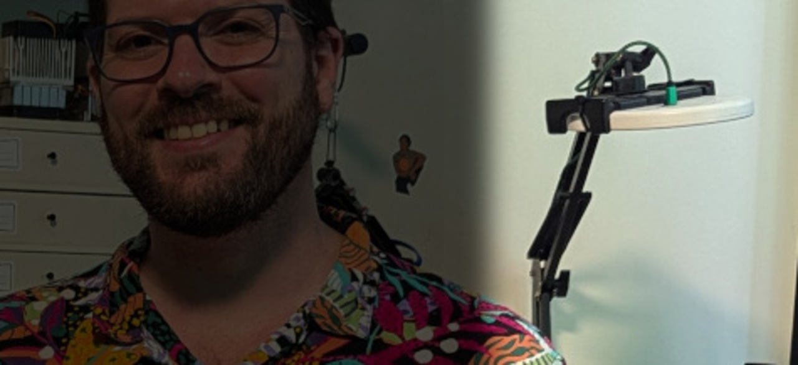
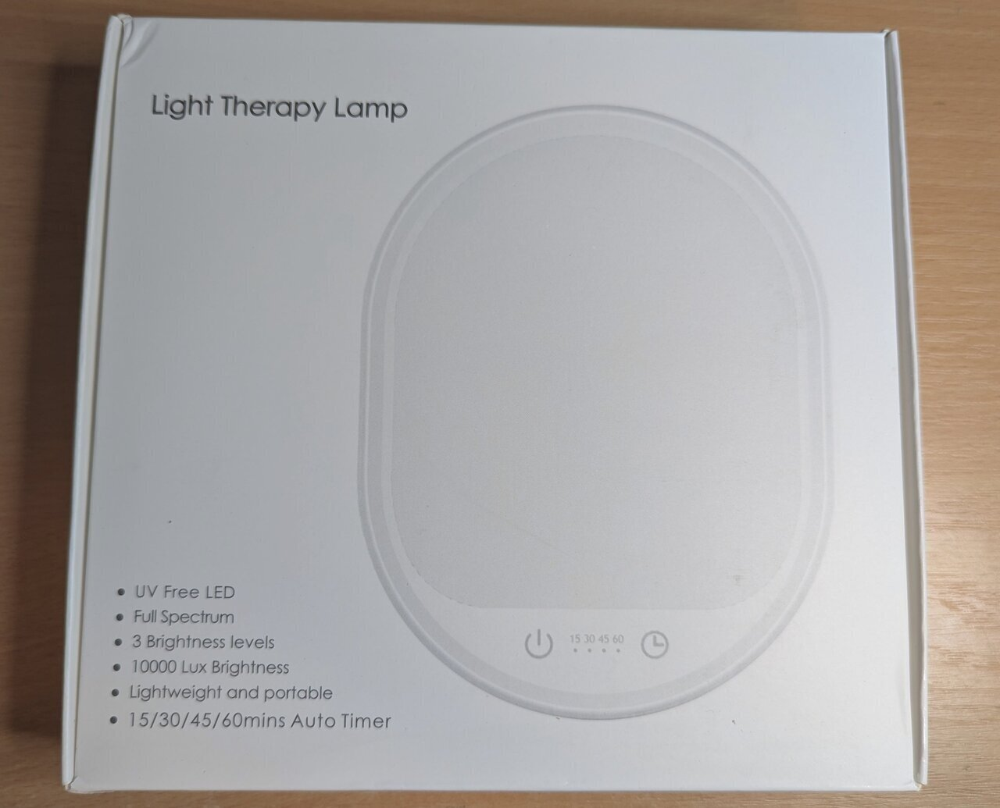
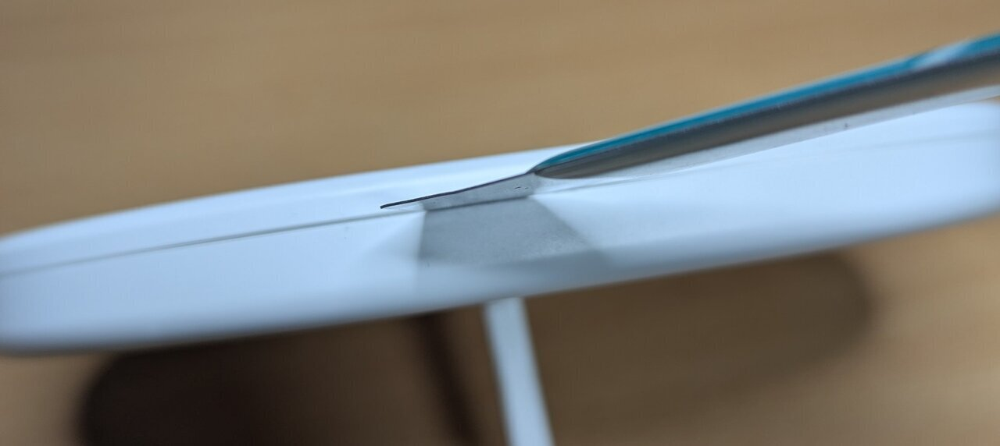
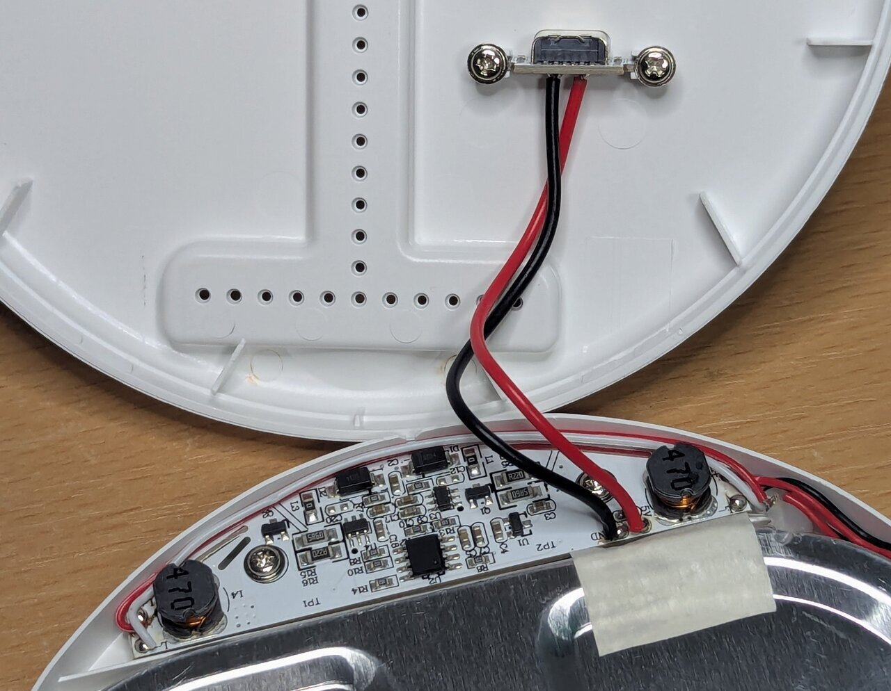
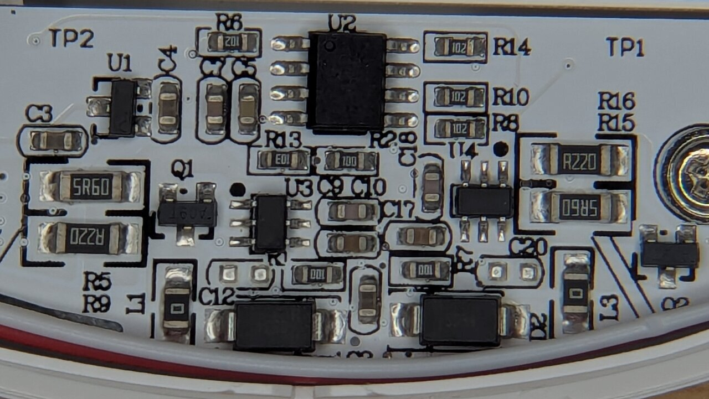
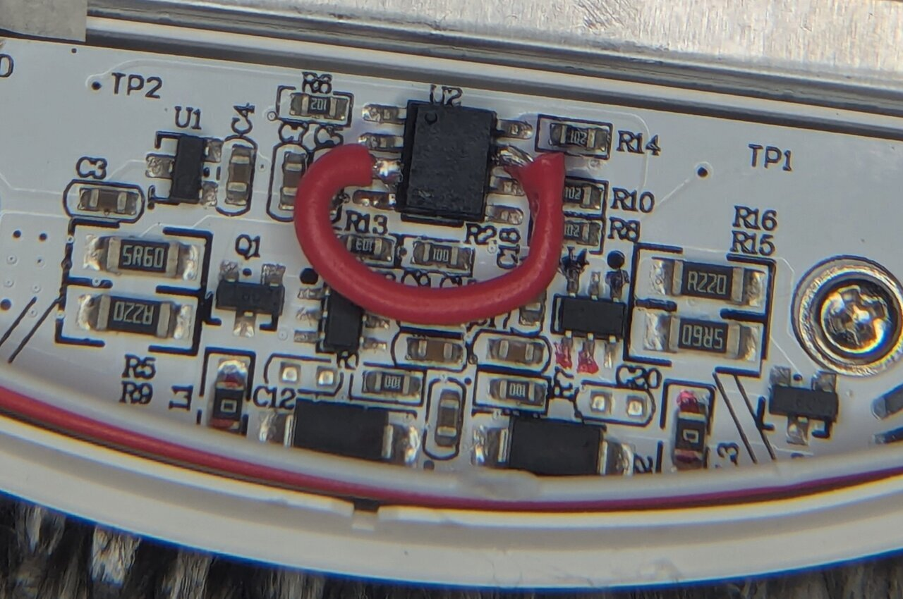
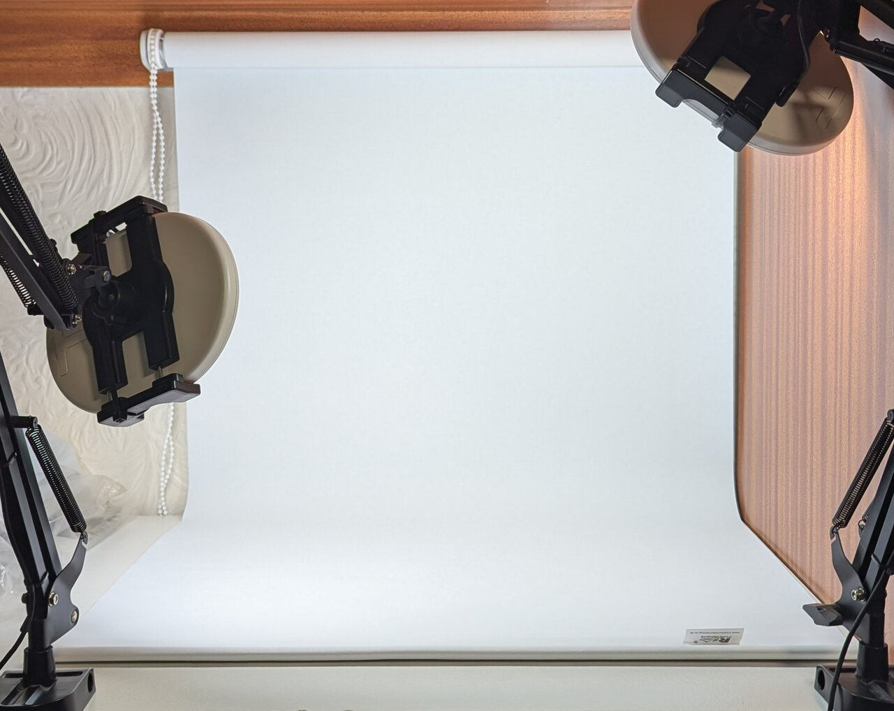
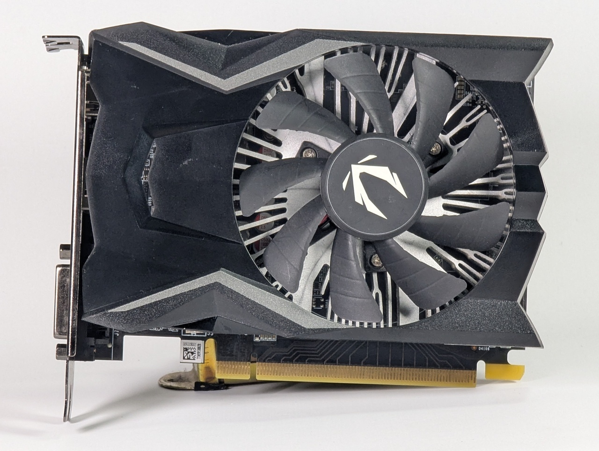

A while back, I needed a lamp on my desk and as part of a reduce-reuse-recycle mentality, I first looked at what I had. Gathering dust was a corporate gift - an SAD lamp that was so bright it gave me headaches. I grabbed my soldering iron and removed the timer, added a switch and mounted it using a mobile phone arm. It worked a treat!

*My lamp makes a guest appearance on the front page photo...*

One day, I wanted to do some photography on my desk, so I swung it into position and added the ring light from my magnifying lens into the mix. I was aghast at how it was outperforming the dedicated lights I had in my usual photo area.

I started using this setup for taking photos of smaller items, but it was frustrating that it meant keeping my work area empty most of the time, so I decided to build a dedicated small item photo area and went to Amazon to try and find something built for the task.

My SAD lamp is 10W, so I assumed any 10W lamps targeted at use for photography, selfies, zoom calls etc. would do the job. Despite a lot of research, and feeling confident each time - the two sets that I bought were really disappointing and were returned. They could barely make my backdrop white, let alone properly light the items.

Granted, I was fishing around in the budget area - but the jump in price was steep going to higher wattage units and most were very large, with big tripods - not suitable for the small space I had set aside.

As my original SAD lamp had worked so well, I tracked down an identical unit for £15 - and as I already had a spare matching phone arm, the lamp was the only outlay.

>The purpose of this article is to put SAD lamps on your radar for budget lighting purposes, but also to show the transferable methodology used for removing the timer to make them "always on".

## Why SAD Lamps?

The photography panels I bought were rated at around 750 lux. This SAD lamp is rated 10,000 lux. I don't think it's genuinely 13x brighter in the real world - lux is distance-dependent and the measurement distance isn't always quoted or consistent between products. A lumens figure - total light output regardless of distance - would make for a far more useful comparison, but it's rarely quoted for either type of product. What I can say is that in practice the difference was significant and immediately obvious.

*UV Free LED, Full Spectrum, 10000 Lux - the specs read more like a studio light than a wellness product.*

>It's worth being clear about the scope of this comparison: I'm talking about budget LED panels in the £10-30 range. Proper photography lighting from reputable brands is a different proposition entirely and will likely outperform a SAD lamp. What I found is that in this price bracket, SAD lamps are a far better option than the panels marketed for photography, selfies and video calls.

So why the difference despite the same power requirement? A few things are likely going on, some more provable than others.

The most concrete issue is the dual LED setup. Most photography panels offer both warm and cool white light, which sounds useful on the surface, but to achieve this, they use two separate sets of LEDs: one half warm, one half cool. If you want pure white light - which you do for product photography - you can only use one set, effectively halving your brightness. 

However, even taking this into account and running at full brightness _(mixed cool and warm LEDs)_ it was still far dimmer. I suspect many budget panels don't actually draw their rated wattage to begin with. They often ship with a 10W power supply, implying 10W draw, but rarely state the actual power draw of the lamp itself. My guess is the real draw is closer to 5W - meaning after halving for pure white output, you could be looking at something closer to 2.5W of useful light. That would go a long way to explaining the gap.

Conversely, SAD lamps are full spectrum by design - the whole panel is one consistent light source. This one is rated CCT 5500–6500K with Ra >92 _(Ra being the same as CRI - just the international standard notation)_, a very high colour rendering index and a clean daylight-range colour temperature - exactly what you want for product photography. 

*Model LQ-05. 5V, 2A, 10W. CCT 5500–6500K. Ra >92. Many available models exceed even these specs.*

The one annoyance is the timer. SAD lamps are designed to switch off automatically. This one has 15, 30, 45, and 60 minute options. For actual SAD therapy, that's fine. For photography, it's not. I just want to flip the mains switch and have both lights come straight on. I might only turn them on for a minute to do photos and then turn it off, so I don't want to go through the rigmarole of finding the power switches on the touch panels each time I turn them on.

>For most people, just using the lamp on its longest timer setting is perfectly fine - this is an optimisation, not a requirement. If you don't mind a bit of soldering, this is a really simple example of basic circuits you can understand and modify. It's low voltage, low risk.

## Opening the Lamp

As is typical of most things these days - no visible screws, just a simple clip-together plastic shell. A spudger run around the seam is all it takes to separate the two halves without damage.

*A spudger run gently around the seam. No clips were harmed.*

Inside, the PCB sits at the bottom of the unit with a couple of wires running to the USB-C connector. It was only two screws, so I removed the connector just to give myself more room to work.

*The PCB lives at the base. Not a huge amount going on here!*

## The Method

This is the methodology I'd encourage you to apply to any similar device - it's not specific to this lamp, and you don't need to be an expert in circuit design _(I'm certainly not)_ but you will need a multimeter.

>The core idea is simple - probe the board _(i.e. check for voltages present in different locations)_ with the device off, then probe it again with the device on, and look for what changed. From there, you're trying to find the component that acts as a gate - something that controls the flow of power to the rest of the circuit. Once you've found it, the goal is to bypass it so it always stays open.

## Reading the Board

Before reaching for the multimeter, it's worth just looking at the board for clues.

*I'm seeing double! Two matching sets of driver components - one per LED array.*

On the left and right sides of the board, you can see two almost identical clusters of components — Q1 and U3 on one side, Q2 and U4 on the other. In the wider shot above, you can see these lead out to inductors and then wires to the LED panel, making it clear this lamp uses two separate LED arrays rather than one. These appear to be two PWM controllers, one per array.

U1 and U2 are the odd ones out — neither belongs to either driver cluster. U1 is likely something power-related, a regulator of some kind. U2 is the more interesting candidate - if anything is orchestrating the timer and touch inputs, it's probably this!

## Getting Probed

With the lamp off, U1 was outputting 3.3V - but Q1 and Q2 were completely dead. Turning it on, the Q1/Q2 transistors came to life at ~3.3V. U1's output was present whether the lamp was on or off. Since it wasn't feeding the LED drivers directly, it was likely powering the control chip, and that 3.3V was likely going straight to U2.

> U2 had its markings laser-etched off, so there's no datasheet to look up. Probing its pins, I found the expected 3.3V - and by pure luck, touching pin 8 also triggered the lights, cycling through the three brightness settings and off with each touch, exactly like the touch panel. U2 was the gatekeeper.

Hardwiring pin 8 would only simulate a button press, not create a permanent on state, and could have undesirable effects. Measuring each pin with the lamp on and off revealed the pair that changed:

- When **off**: pin 3 read **3.3V**, pin 6 read **0V**
- When **on**: both pins 3 and 6 read approximately **3.1V** _(a small droop under load)_

So bridging pin 3 to pin 6 should bypass the chip entirely. To test this theory I used a pair of metal tweezers and touched the pins at the same time to create a connection. Immediately the lights switched on. _(Do check your tweezers have continuity first if you are going to do this)._

*Not the neatest soldering, but it's solid, it's hidden, and it works.*

With my bodge wire in place, the lamp now stays on all the time, but as a result we lose the timer and the ability to change brightness. If I need it to be less intense, I just move it back a little - a happy trade off.

## A Note on UV Lamps

I've used the same technique to remove the timers from UV lamps for retrobrighting. It works just as well, but there's an important caveat.

SAD lamps are designed to run for up to an hour at a time, so they handle always-on use well. UV lamps for domestic use are often designed for just a few minutes. When I ran mine for extended retrobrighting sessions without a timer, several of the LEDs died. But considering they were designed to be single use _(curing screen protector glue)_, they still got a better life than intended.

>If you're applying this to UV lamps or any other device with a short duty cycle, bear in mind that the timer may be there to protect the hardware as much as the user. Proceed with that in mind.

## The Result

With two lamps modified and mounted on mobile phone arms, I have a flexible two-light setup that I can reposition freely to control shadows and reduce glare. Both come on the moment I switch the mains, at full brightness, with consistent colour temperature across the whole panel.

*I use white blackout blinds as backdrops as they are cheap, you can roll them up when not needed and trim them as they get damaged.*

The proof is in the results - at this point I feel the limiting factor is my phone camera, not the light.

*First proper test shot under the new setup. Clean, even light with no colour cast.*

If you've been frustrated with dim or colour-shifting LED panels, it's worth trying an SAD lamp. Repurposing something you already own, or picking one up cheaply, and modifying it is a much better outcome than buying yet another disappointing panel light.
