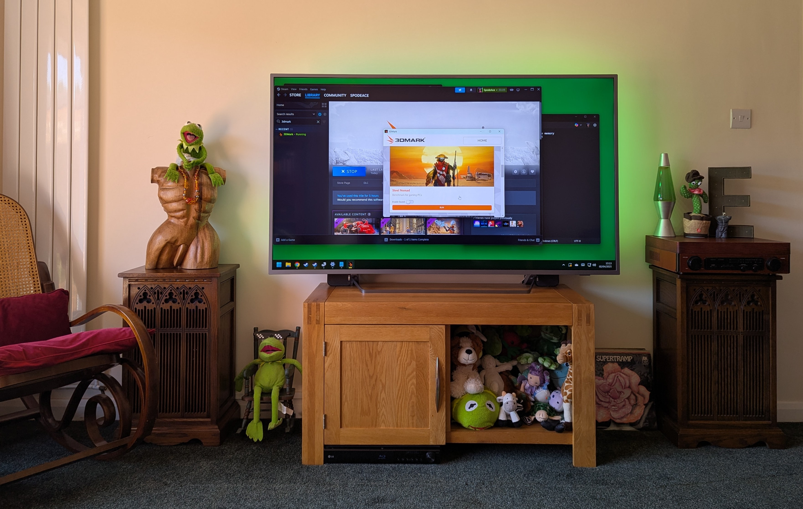

Can you guess where my PC is? It's in the speaker cabinet on the left under the bust of Julian (named after the Simpson's episode where Homer suggests Julian is the manliest of all names) and the right cabinet houses my subwoofer. 

I've been wanting to change this TV unit for a while now as it's the wrong tone for the room - but it was one of the few units I could find that I could fit a full-sized computer case into. The area that is now (temporarily) full of kids toys, is where my previous machine used to live.

Now that I have built my new machine into the cabinet, I can explore a different unit. But for those interested, I thought I'd write up how I achieved this. 

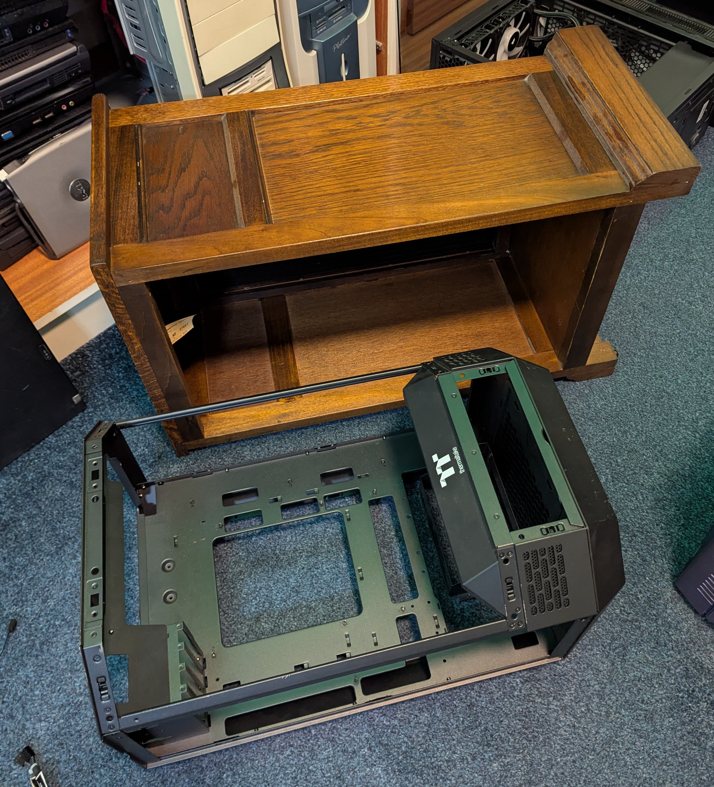

I bought my new PC second hand, but the chassis (Thermaltake The Tower 300 I believe) was missing the glass and a few other bits. Besides, I've been talking about building a new PC into this speaker cabinet for quite some time and that's what I wanted to do.

I stripped the PC and sized it up against my speaker cabinet. I don't know much about the cabinets themselves - I got them second hand as a pair for £10 several years ago in a probate house clearance - but I'm guessing 1970s. They are a heavy and seem well constructed. I appear to be one of the few people still alive that likes dark wood.

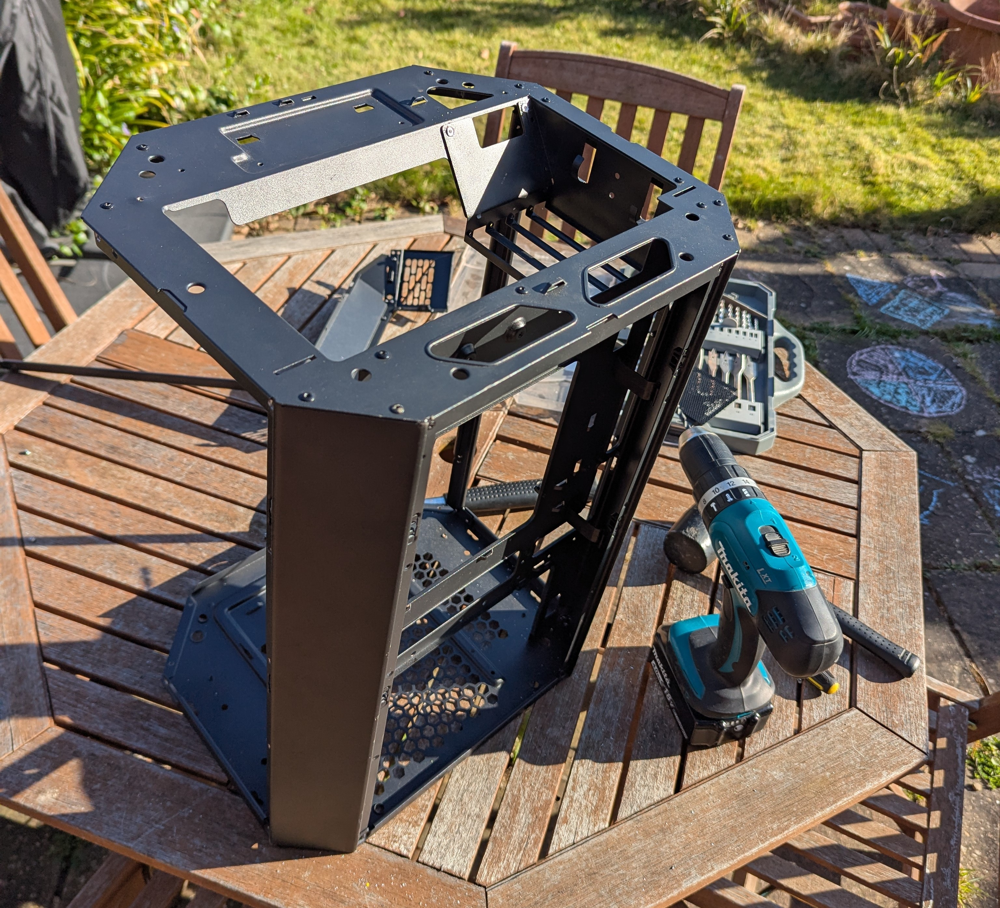

To get to the mounting plate, I was going to have to fully dismantle the chassis. Once I had unscrewed everything, I was left with a bare-bones chassis that was pop riveted together.

Using a 5mm drill bit, I drilled out the rivets and then if needed, tapped through the remaining rivet with a screwdriver. 

Once I had the final mounting plate, I needed to cut it to size. I opted for a jigsaw but even with a fine blade designed for metal, it was extremely hard to control and kept snagging. I ended up finishing things off with a hacksaw.

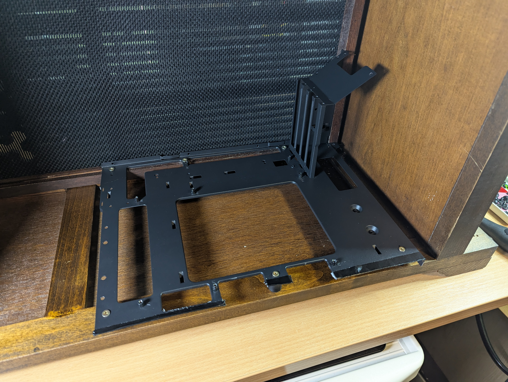

Once I had cut the tray, I filed the edges, but I was still a little concerned about catching on it, so I put some strips of black gaffa over

The left hand part of the tray is resting on wood that is higher than the right edge, so I used some large cylindrical washers around 20mm high from an old TV mounting unit to address the balance.

I lined it up, marked some holes with a marker and then drilled them out. I then put it back in position, marked where the screws should go and then drilled pilot holes, so I didn't split the wood.

Once screwed in, it's lovely and solid and this gives me the flexibility to change motherboards etc. at a later point without hassle.

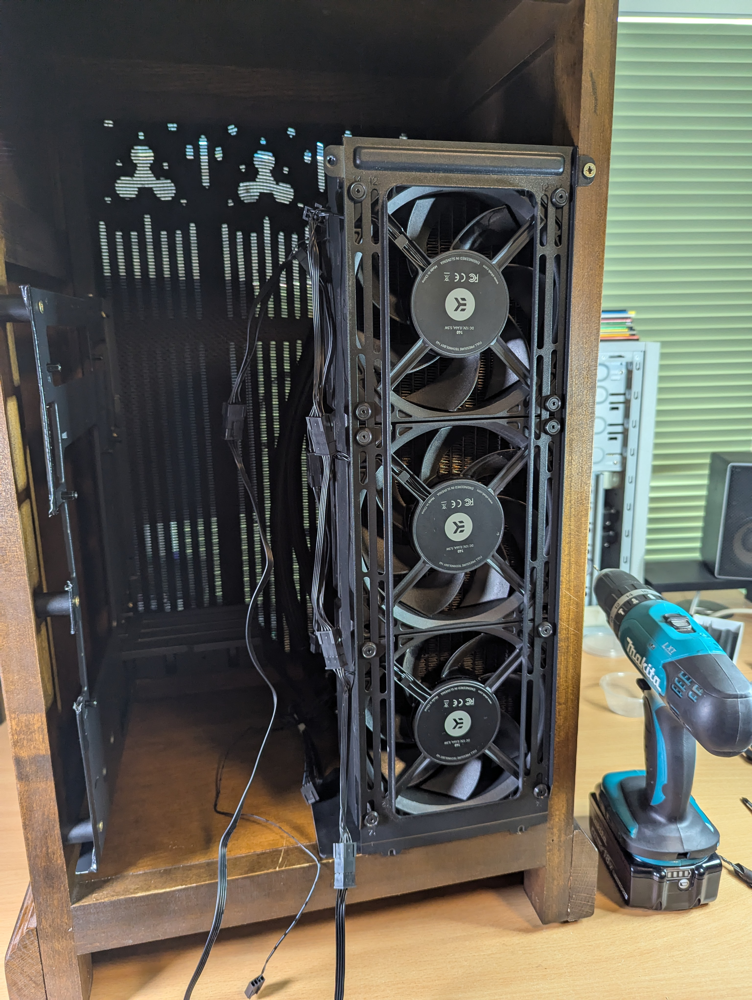

This is an Arctic Liquid Freezer III 420. It's fairly hefty so I wanted to let gravity do a lot of the work for me, so I put a rubber mat (for vibrations mostly) on the wood and then let the radiator sit on this. Then I just needed to make sure it didn't move.

Originally the outer metal piece was sandwiched in-between the fans and the radiator, but I removed the fans and moved it. This metal piece is from the original case - there are two little tabs at the bottom - these sit over the wood and stop it from sliding inward. 

Then, in the top-right I have a single screw holding the metal to the wood. As it's butted up perfectly to the wood, this is extremely sturdy. The person that had this machine before me had added 3 more fans for a push/pull setup and then used Noctua low noise adapters to, I assume, run them all at a lower RPM. 

The hope is, this will pull fresh air in from the front grille and then push it out the back. There will be around 1-2" gap before the wall face, which shouldn't be close enough to create significant back pressure issues. 

Air tends to follow the path of least resistance - so I'm not convinced this will actually pull air through the grille without a fan butted up right against it. It will more likely just circulate air in the speaker cabinet - but there should be significant enough flow that it won't cause me any issues.

If I start getting thermal issues - then I think mounting some fans on the grille itself will be the solution.

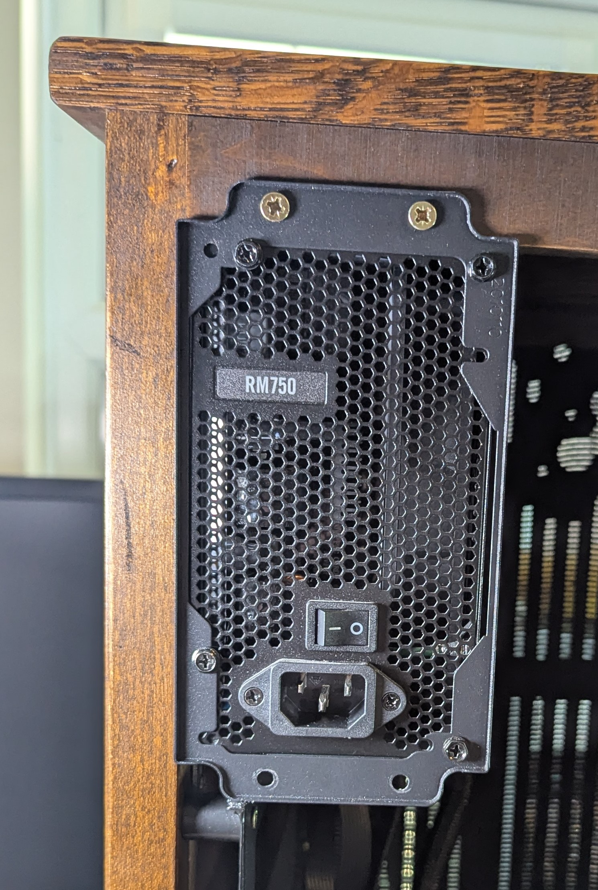

The PSU was the least concern as there were multiple places and orientations it could work in. I used the original case plate for the PSU and two screws at the top. The bottom part of the plate is actually resting the on the motherboard tray.

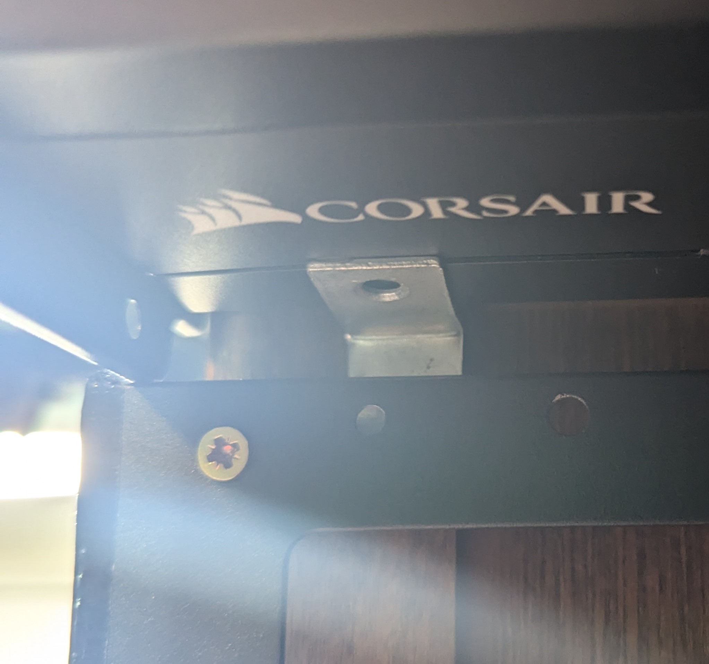

As there were no screws holding the plate at the bottom, I installed a single L bracket for the PSU to sit on, in the only position where the wood was thick enough to do so. It wasn't needed, but I felt it was a nice fail-safe.

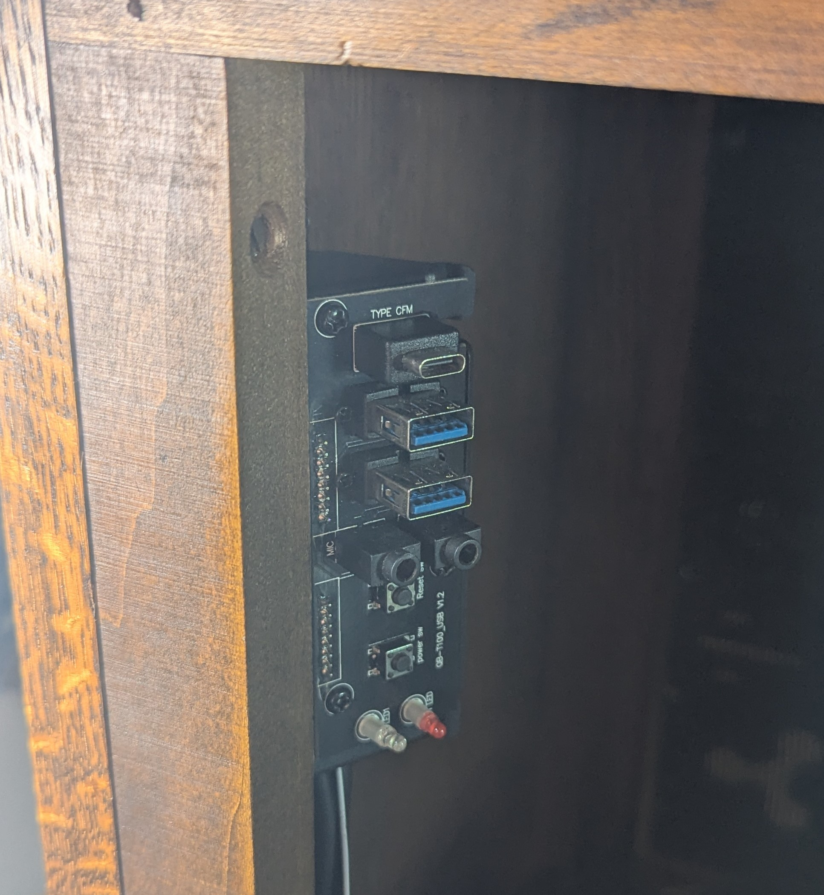

I took the front panel from the old case - but it was missing the plastic surround. Not a real issue as it's hidden. Putting it like this at 45 degrees means my USB devices have more length without hitting the wall and I can easily reach my hand over the back of the unit to turn it on. In reality, I tend to leave it in sleep mode - so I won't need to do this much.

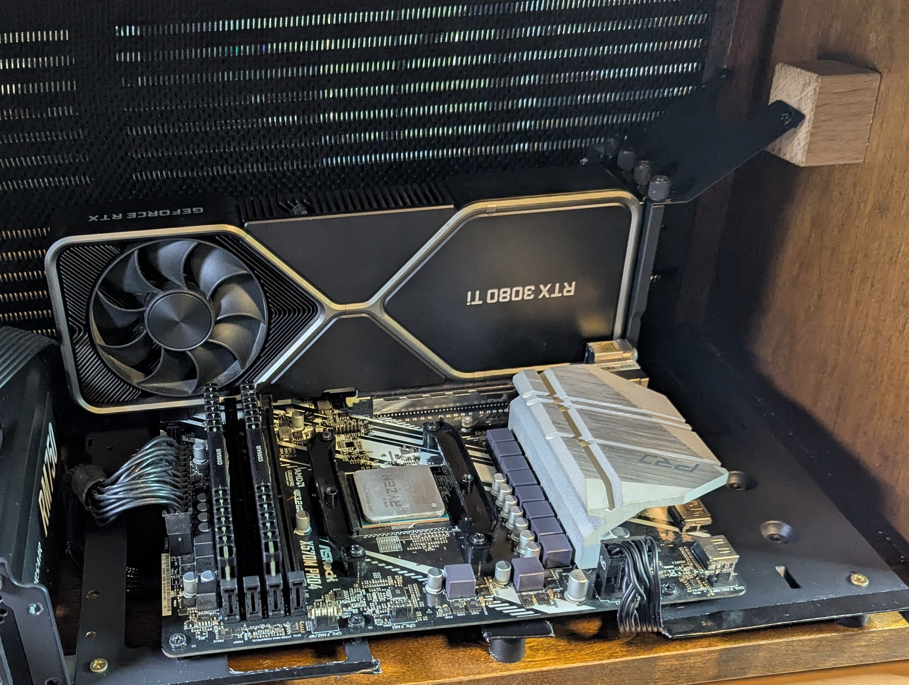

The original expansion slot braces stiffen up the GPU mount and the left-hand side is screwed into the wood, but the right hand-side was floating and this is where the majority of GPU weight will be.

Again, I wanted gravity to work with me - not against me, so I put a small wooden block that I had handy under the metal and popped a screw into it. Take into account you are looking at the case side-on at the moment, so when it's up-right that means the GPU weight will be distributed very well.

One thing I didn't consider at this point was the GPU size and I got very lucky that it fit. If I end up with a larger GPU in the future - I'll need to reorientate the PSU.

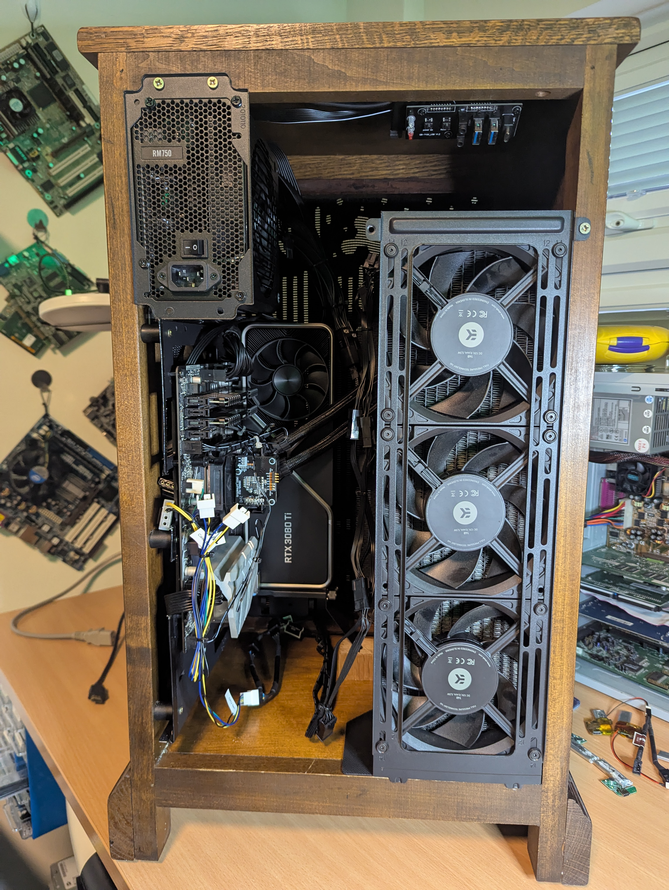

Finally, I put the AIO back in and tidied up the cables. Everything is solid!

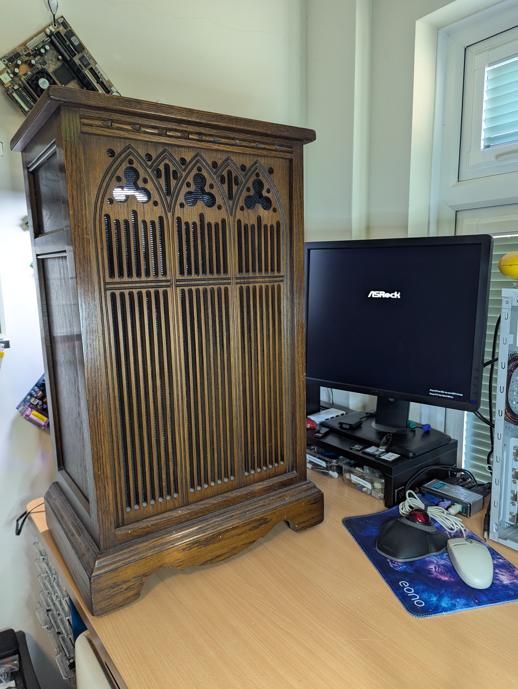

I must admit, at this point the absurdity of what I had done kicked in - this is definitely the oddest thing I've had on my test bench. But everything worked first time and I installed Windows 11 before cleaning the wood and getting ready to transpose it.

# Conclusion

I'm really happy with the end result - in fact, I would say it's come out far better than I was expecting. There are only a couple of things I would do differently - 1) have the PSU mounted at 90 degrees to allow more GPU space and 2) add a short HDMI extension lead to the GPU before I built it, as it was fiddly trying to find it.

Big thank you to Rob for arranging the machine for me, and Joe as an extra pair of hands during the build!

