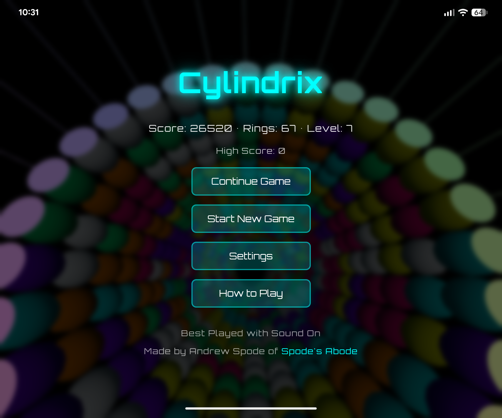
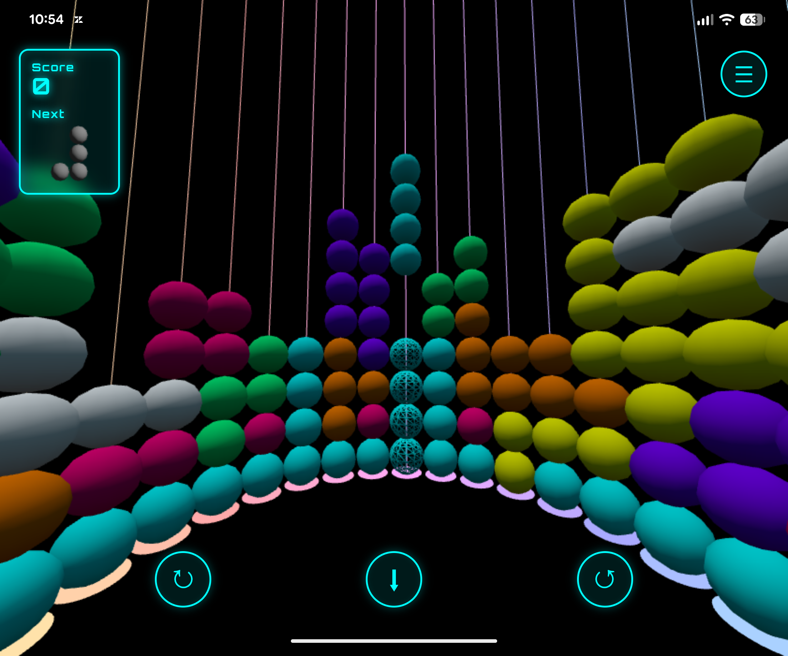
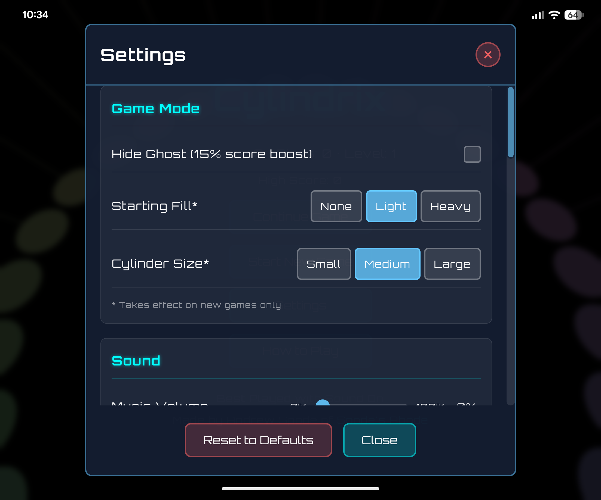
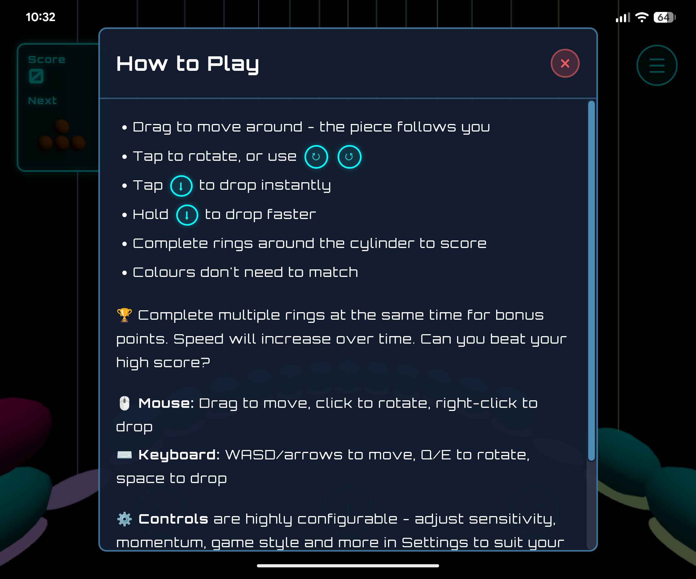

This is my first proper attempt at making and publishing a mobile game. Originally my idea was to have this as a VR game and I started casually prototyping the concept using Claude AI and quickly realised it would work on mobile. After some time and effort, it's now [available to play on Google Play](https://play.google.com/store/apps/details?id=com.spodesabode.cylindrix).

The gameplay is unashamedly a Tetris clone, but playing it on the inside of a cylinder really adds a new dynamic. As you can't see the entire game grid at one point in time, you have to keep track of what goes where mentally. This makes it more challenging and exciting.

The audio engine uses oscillators for the sound effects - it's subtle but as you are moving around the cylinder you'll hear an "engine" sound that changes with the speed of movement. I was trying to capture something similar to how I remember the Recognizer in Tron sounding.

I also spent quite a bit of time on the controls, with a large number of settings to help tweak it to how you like. I'm a big fan of the Steam Controller, so I wanted momentum-based controls where you can flick to spin quickly across the cylinder rather than drag. You can alter the friction and sensitivity to find what is comfortable for you.

I dislike adverts and always-online games, so I went with a shareware model - free to play with occasional upgrade prompts for £1.99. Finding the balance between encouragement and annoyance will need tweaking over time.

Shareware isn't the only retro influence. No Internet means only a local score board and no barrage of micro-transaction offers and other distractions. I went for a synthwave sound track _(generated using AI, not me this time)_ and took inspiration from Tron for the aesthetics.

I'm really happy with the outcome for my first game, and it's going to be an interesting journey seeing how the market reacts (or doesn't). Huge thanks to my friends and family for helping me test it along the way.

## Where to Play

Currently available on [Google Play](https://play.google.com/store/apps/details?id=com.spodesabode.cylindrix). The game supports keyboard and mouse controls as well as touch, so it should also work on PC through Google Play Games.

An iPhone release will depend on how popular it is on Android.

## About the Game

Experience the classic block puzzle like never before - reimagined inside a rotating 3D cylinder. Spin 360° around the cylinder to position and drop falling pieces. The full circular playing field tests both your reflexes and spatial memory as blocks wrap around the cylinder's surface.

Highly configurable controls work seamlessly across touch, mouse, and keyboard. Adjust sensitivity, momentum, field of view, and more to match your play style. Your progress saves automatically, so you can pause and return to your game anytime.

Features an original retro synthwave soundtrack and aesthetic that perfectly complements the gameplay. Progressive difficulty keeps you engaged as speed increases with each level.

Completely free to play with no adverts and fully offline gameplay. Occasional 10-second upgrade prompts can be removed with a one-time £1.99 purchase to support indie development.

Perfect for puzzle fans seeking a fresh challenge, retro gaming enthusiasts, and anyone who enjoys spatial puzzles with a unique 3D twist.