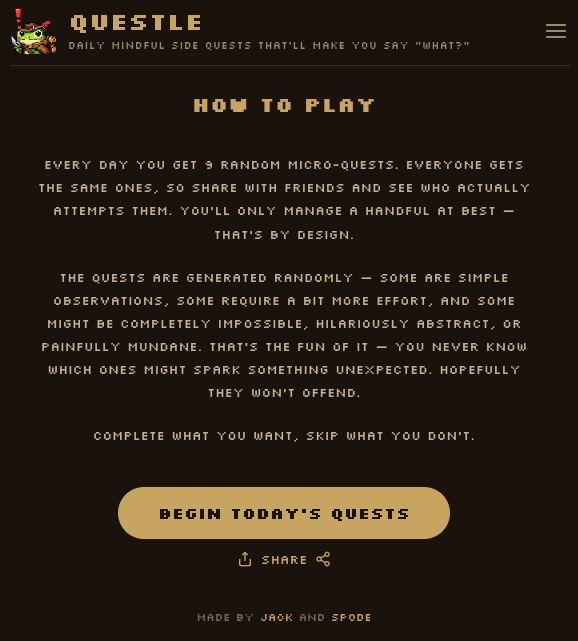
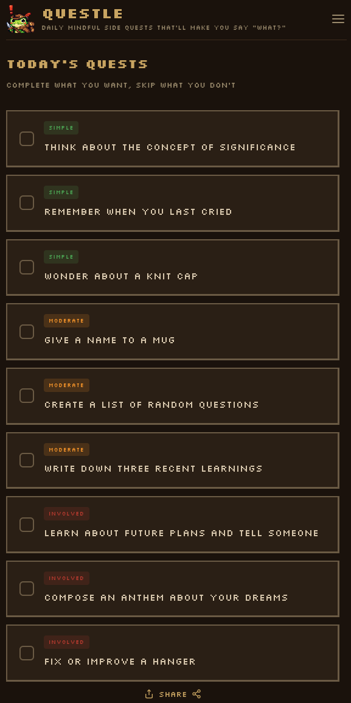

Questle started as an experiment. Instead of the usual "hey, I have this great idea, let's build it" approach, my friend [Jack](https://jpb.dev) and I sat down with a completely blank slate and had a brainstorming session, using our preferred AI (Claude) as a mediator and catalyst. 

Our starting point was extremely loose - "something to make you look forward to Monday morning". We came up with some truly awful ideas _(no bad ideas, right?)_ but eventually we got our core concept down. Then we prototyped and iterated until after a few evenings we ended up here with our fairly polished [Questle](https://questle.app).

The concept is extremely simple. Every day you get **9 randomly generated micro-quests**. Some are simple observations, some are creative tasks, and some are delightfully absurd. Think about the concept of significance. Give a name to a mug. Compose an anthem about your dreams. There's no scoring, no streaks, and no pressure — complete what you want, skip what you don't. 

One thing we borrowed from Wordle (hence the name) is the idea of a **shared daily experience**. Despite the code being capable of generating literally millions of unique quests, we rejected the idea of a reroll button and instead made it deterministic — every player gets the same 9 quests each day, seeded from the date. This means you can share with friends and compare who actually attempted what. Don't like the quests? You come back tomorrow.

Rather than taking the lazy route and having AI generate the quests themselves, we crafted over 90 unique sentence structures with variables for the verbs and nouns. We then created these lists of words _(well, Claude did)_, categorised and nested them so we could be as loose or granular as we wanted — "things" to encompass all objects, or right down to specifics like "furniture" or "nature items". To keep things grammatically correct and handle things like singular/plural properly, the sentences sometimes ended up a little unnatural sounding, but we think this adds to the charm and gives the quests their distinctive unusual quality.

The whole thing runs as a lightweight responsive PWA - no frameworks, just ordinary JS and deployed to Vercel where it becomes serverless automatically _(much to Jack's objection, being an AWS fiend)_.

## Where to Play

Play it now at [questle.app](https://questle.app). It works on any device with a browser and can be installed as an app on your phone. It's free!