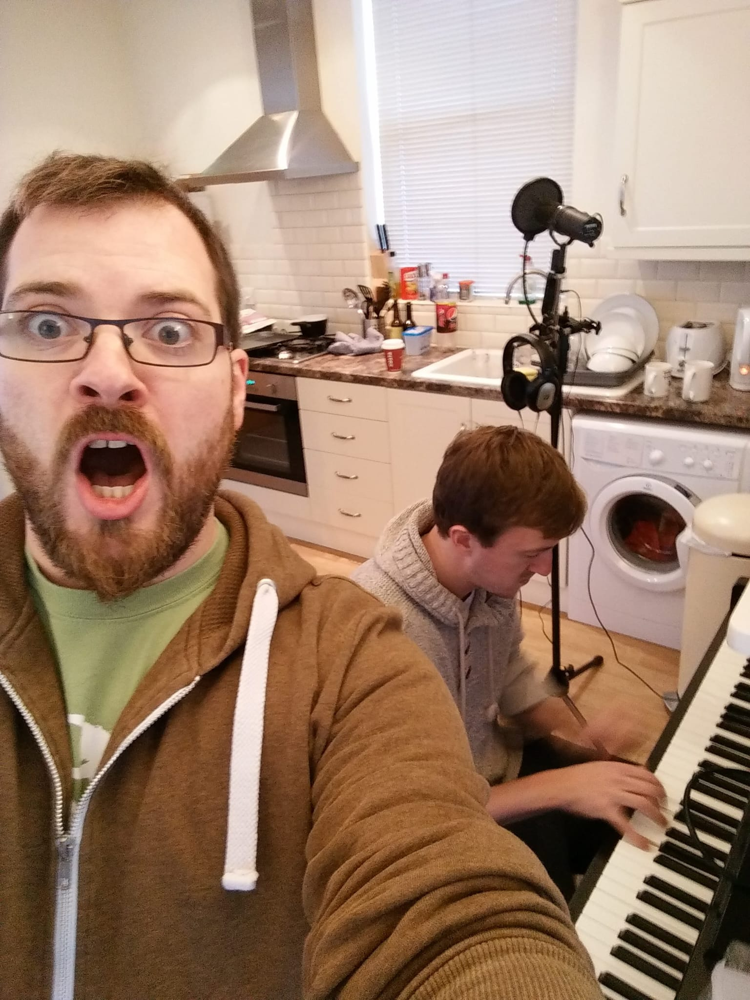
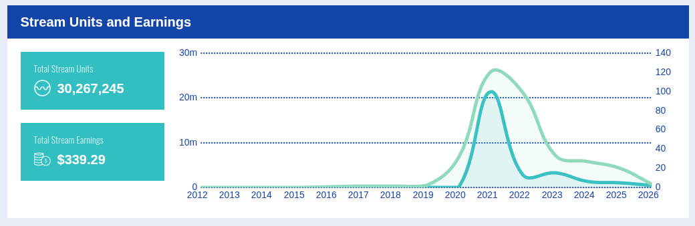

Kittens in the Snow was particularly popular with my eldest sister's children, which I didn't believe until she sent me a video them singing it, seemingly knowing all the words by heart.

So I wrote this song specifically for them, semi-hiding their names into the lyrics. "Her name was Katie and she smelled like a rose" (Katie Rose) "and a bell was attached" (Annabel).

The image used for the artwork was of my then business partners family dog, Comet. I'm not much of a dog person, but he was lovely.

The track was recorded November 22nd 2015, again, with the intention of a Christmas release. I took this photo while Richard was working out the melody on the piano and you can see my SM7A and USB interface in the background.

I was never very happy with the song, so after release I simply forgot about it. Nearly a decade later, I logged in to my RouteNote account by chance and spotted that it had been streamed over 30 million times. You can imagine my surprise.

You'd think therefore, that I would have made some decent money - but as you can see - barely anything. 

Much of the use of the song has been on TikTok, where people used it in the background of videos of their dogs and TikTok, rather than paying per stream - pay per video. From memory, it was around 10,000 videos that used the song and I got a fixed fee per video. A video streamed once earned the same as one streamed a million times. I believe ~100,000 streams on Spotify made more money than the total of all TikTok use, despite the magnitudes in difference.

Additionally, many people simply downloaded the video once they had made it, hosting it on other platforms to use as an advert for their dog grooming businesses, bypassing the royalties altogether.

For those that want to sit here and complain that AI is killing the music industry - it is merely a nail in the coffin to what streaming services have done to it. Certainly there's no "About a boy" future for me.

## Lyrics

Today I went to the park, and what did I see?  
A fluffy little dog was staring at me  
It had big wet nose and shiny fur  
By the way it was walking I could tell it was a her  

It was a fluffy little dog  
It’s eyes were gentle with a cute little chin  
It was a fluffy little dog  
It’s coat was yellow and her tail was thin  
It was a fluffy little dog  
And i really want it  

I went to it slowly and the owner said hey,  
Would you like to pet my dog today?  
I looked to my parents and opened my mouth  
But they knew what I wanted and said it was allowed  

It was a fluffy little dog  
It sniffed my hand and it tickled me  
it was a fluffy little dog  
It’s fur was lovely like a persian rug  
it was a fluffy little dog  
I’m going to throw it a stick  

Her collar was red with her name in gold  
We gave her a treat when she did what was told  
Her name was Katie and she smelled like a rose  
And a bell was attached to stop us stepping on her toes  

It was a fluffy little dog  
We ran around and it was faster than me  
it was a fluffy little dog  
Her tail was wagging, she was so friendly  
It was a fluffy little dog  
Can I keep her?  
