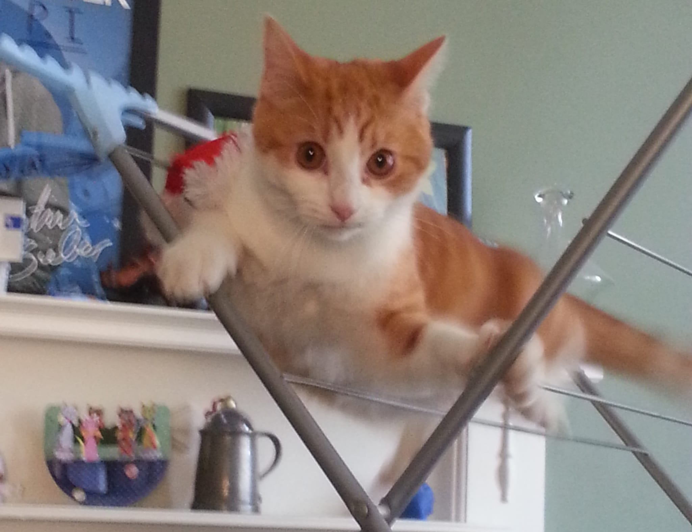

I first released this track on December 9th 2012 - it had started to become a traditional time for me to release new songs, in time for Christmas.

I had a new kitten at the time - "Geoff from Marketing" and I remember I would look out of my kitchen window and find myself singing this melody. It stuck with me and inspired me enough that I eventually invited Richard Williams to come over and write the song with me.

*Geoff was my muse, and a menace - he once managed to chew through my washing machine inlet pipe and flooded the flat below!*

Once we had the rough song, Richard recorded a scratch track and e-mailed it over to me to work from. I then recorded all vocals, including backing at home using my Shure SM7A on a Shure USB interface and sent them back to him. He re-recorded his instrumentation and mixed things together into the final track.

The photo used for the song came from (with permission) [Nate Lanxon](https://en.wikipedia.org/wiki/Nate_Lanxon) after I had made a request on Facebook for pictures of people's cats in the snow, not having any of my own.

It was popular only really among my friends and family, and primarily with people's children. I always then regretted that the lyrics had some double meaning in places. I did consider re-releasing it with adjustments, but decided that much like Simpsons episodes - the jokes would just go over their heads.

## Lyrics

I looked outside and I saw a kitten  
I saw a kitten in the snow, in the snow  

I looked outside and I saw a kitten  
I saw a kitten in the snow, in the snow  

What would you do if you saw a kitten?  
Would you turn away, or would you smile to your self?  

Some people say that they don't kittens  
But they are dying inside, and they're lying to themselves  

Cos when I look outside and I see a kitten  
I love seeing kittens in the snow  

Cos there's nothing better than when I see a kitten  
I see a kitten in the snow, in the snow  

Some people say that a kittens only smitten  
If it's fed every day, they don't care who its from  

But a kitten only gives as much as you give it  
It can't play with itself, because that's plain wrong...  

Then I look outside and I see my kitten  
I see my kitten in the snow  

Then I look outside and I see my kitten  
I see my kitten in the snow, in the snow  

in the snow, in the snow, in the snow...  

Then I look outside and I see my kitten  
I see my kitten in the snow, in the snow, in the snow  

in the snow, in the snow, in the snow  
