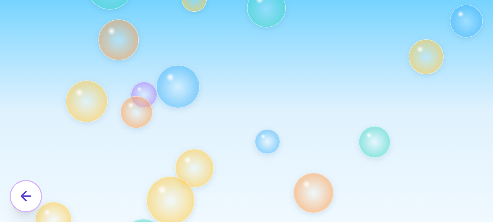
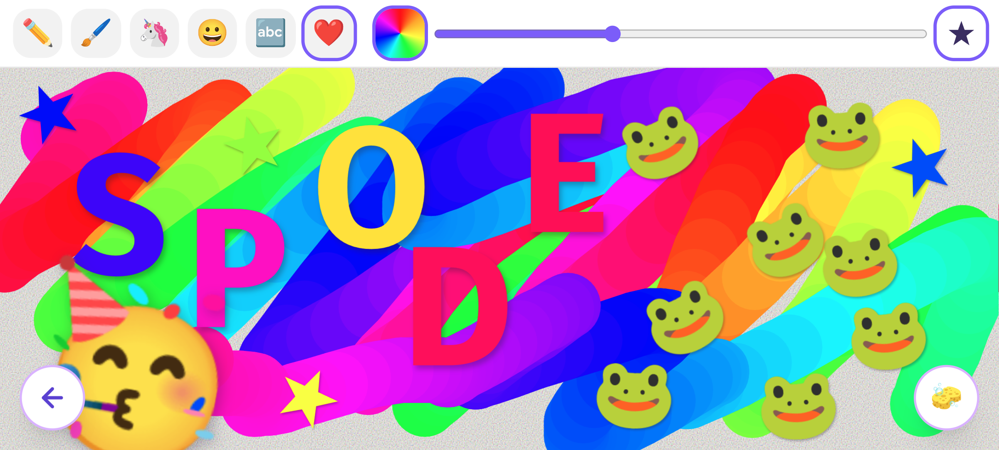
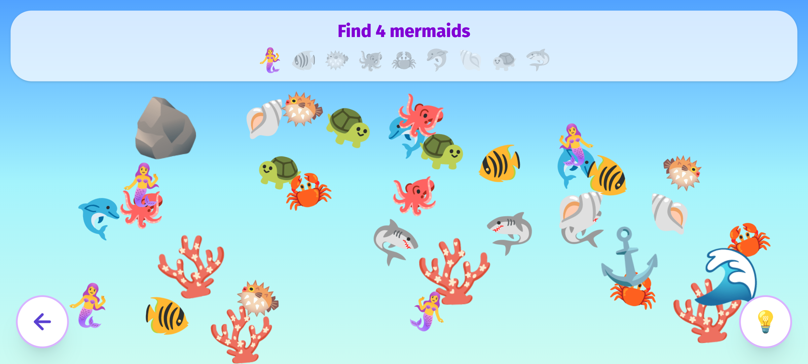
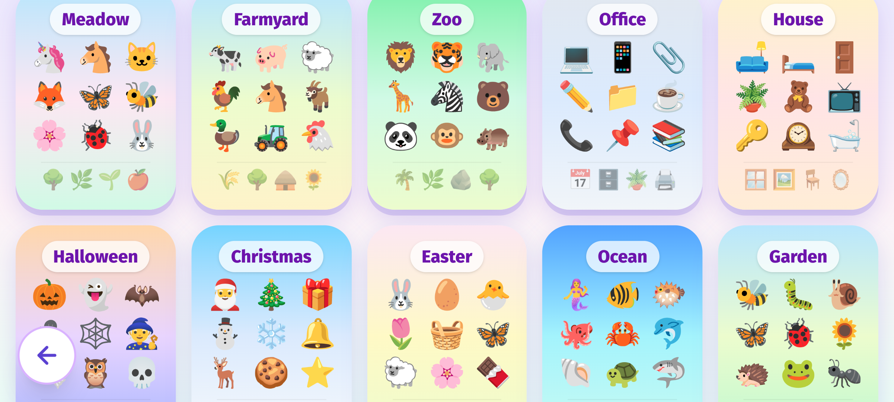
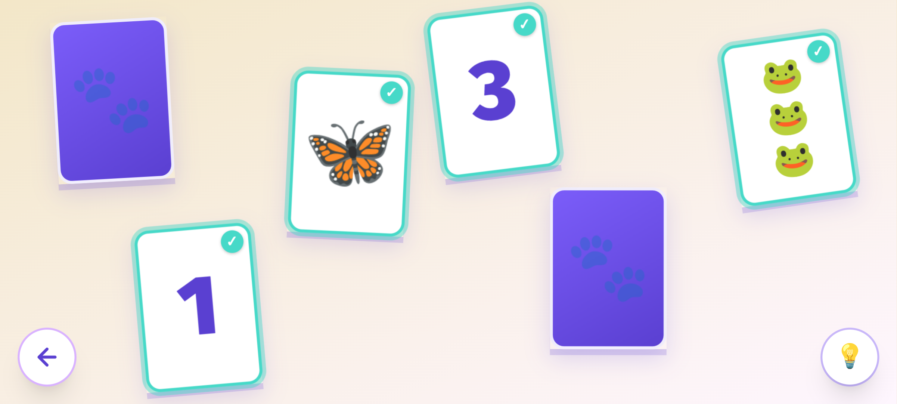
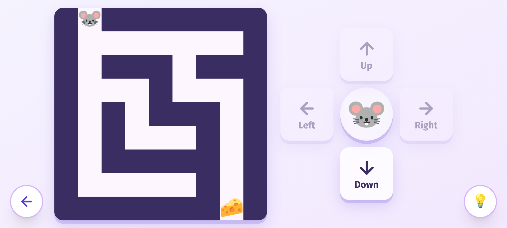
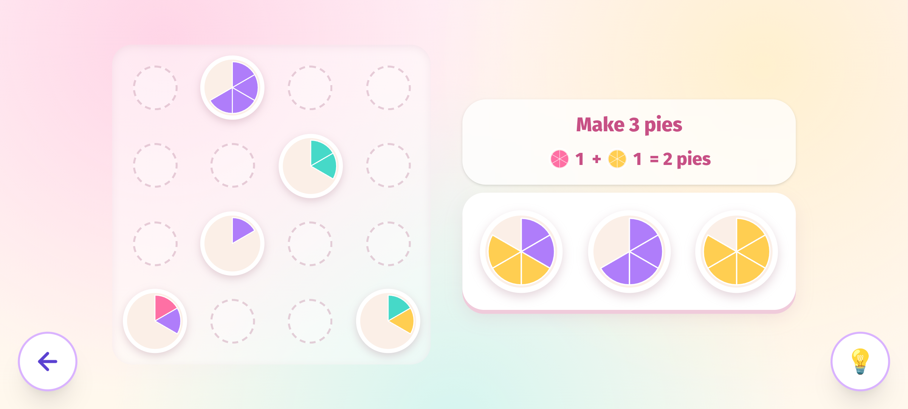

[Launch Spode's Playground](https://spodesplayground.vercel.app/)

Raising a child in a world full of adverts, micro-transactions, and dark patterns is hard. Spode's Playground is my small antidote - a collection of offline-first, ad-free games and activities built for young children. **No ads, no in-app purchases**, and nothing engineered to grab their attention. Just simple, gentle play.

It's not a replacement for interacting with your child - it works best if you play alongside them. But it's a genuine alternative to sitting them in front of questionable YouTube content or handing them a game encouraging micro-transactions.

Rather than an app, it's just a **shareable URL** for simplicity and compatibility with most devices. But it's a PWA - which simply put means you can "install" it to your device from within Chrome, allowing you to **run it offline** and full screen.

On Android, and presumably on iPhone these days - you can simply "pin" it to prevent them using your phone or tablet for something else and safely give it to them.

As my daughter grows, so will this collection.

## Designed for little hands

One thing I was determined to get right was multi-touch. Children have a habit of resting a hand on part of the screen, or holding the device with a finger touching the glass rather than the sides. I didn't want that to break anything. Every activity and menu is built so that a stray touch never stops the right one getting through.

It also means many of the activities work well as a shared experience. You can both paint on different parts of the screen, pop bubbles at the same time, or take turns finding objects without squabbling over who gets to pick next.

If something isn't right for your child's age or you'd rather they didn't have access to it, you can disable individual entries from the parents settings. You can also control whether sound is on or off globally from the same place.

I tested everything primarily on a Google Pixel 6 and a Samsung Galaxy Tab S2, designing for both portrait and landscape. I've heard it works well on iPhone too - but if you run into any issues, please get in touch and I'll happily look into it.

## Games and Activities

### Bubble Pop

Pop the bubbles before they float away. That's it - and that's the point. There's no score, no timer, no mechanism pulling you toward the next thing. Just the simple satisfaction of tapping something and watching it burst.

I had feedback asking for a score - and I deliberately didn't add one. This is aimed at very young children, around one year old, for whom just tapping something and making it react is a skill still being developed. A score would add nothing at that age. What matters here is eye tracking, coordination, and cause and effect - and the pure enjoyment of popping something.

It works beautifully with multiple fingers or multiple people - you can both be popping at the same time without getting in each other's way. My daughter has taken to assigning roles - "you pop the blue ones, I'll pop the purple ones."

### Paint

Paint is probably the one I've spent the most time on - because it's the kind of thing a child can pick up on day one and still be getting something from years later.

Out of the box it paints in a shifting rainbow - the colour cycles through the hues as you draw, so even doing nothing clever looks good. Behind that there's a full colour wheel and a selection of gradient-based colours if you want more control. A slider lets you adjust the brush size, and the paintbrush mode adds a softer edge that reacts to how quickly you move - tapering on and off as your finger lifts for something closer to a real brush stroke.

Beyond freehand drawing there are stamp modes: animals and characters (unicorns, frogs, that sort of thing), faces, letters, numbers, and basic shapes. The face stamps are particularly good for talking about emotions. All stamps are placed with a small random rotation so they feel natural rather than mechanical.

There's no save button - I didn't want phones filling up with drawings. If something's worth keeping, take a screenshot.

The design principle throughout was that if you never touched a single button, you'd still enjoy it. Everything extra is just there when you're ready for it.

### Find It!

Loosely in the tradition of Where's Wally - find the hidden objects before moving on. There are over 25 scenes to explore, from the office to the garden to outer space, each filled with scenery items and nine different types of thing to find.

The game asks for a specific number of something - "find 4 moons" - and counts down as you tap each one. This quietly introduces words, numbers, and counting alongside the core skill of just finding the things in the first place.

Each scene starts simple and gets progressively busier as you complete rounds - more items of each type appear, making it harder to spot them. If it gets overwhelming, a hint button makes the next target gently pulsate so nobody gets stuck. It's unlimited - the point is to have fun, not to grind. Picking a new scene resets the difficulty if you fancy a fresh start.

### Pair Up

The classic memory card game - flip cards over, try to remember where things were, match them up. The twist here is that instead of laying cards out in a neat grid, they're scattered naturally across the table at slight angles. That's deliberate. People often remember spatial positions by feel rather than coordinates - "the three was sort of over to the right, a bit wonky." A natural layout trains a more natural skill.

There's a second twist that makes this considerably harder than the usual version. One card shows a number - its match shows that many animals. To make a pair you have to count the animals first. Memory and arithmetic at the same time.

The game scales up to 9 pairs - 18 cards scattered across the table at once - which is genuinely tricky even for adults. For younger children who can't count yet, the hint button finds a match for them - which means they still get the enjoyment of flipping cards and seeing animals paired with numbers, with a grown-up alongside to talk through the counting. It works best as a guided activity for the little ones, and as a genuine challenge once they're ready to go it alone.

### Maze

This one was inspired by a cheap kids camera I picked up. It came with games installed, and the maze stuck out - it was teaching my daughter to navigate a character using left, right, up, and down. Good concept, but the difficulty never changed and the levels were fixed. Once you'd done them, that was it.

Mine generates the mazes randomly, so there's always something new, and you can choose from different difficulty levels depending on what your child is ready for. You can also pick which character you want to guide through the maze - or leave it to chance.

As with the other games, there's a hint button - pressing it briefly reveals the correct path and nudges the character one step in the right direction. For children who really struggle, they can just keep pressing it and watch the character find its way home. It still develops something useful - they're watching the route, following the logic, building an understanding of the space even if they're not driving yet.

### Pie Sort

The game that started all of this. I'd been playing Cake Sort on my phone and noticed my daughter was drawn to it - matching colours, dragging things into specific spots. I stripped the concept back and built my own version around what she was actually getting from it.

The core mechanic is familiar if you've played this style of game: place a plate of pie slices next to others of the same colour, and the slices cascade between plates in a chain, self-organising. In practice you're looking for the dominant colour on a plate and moving it somewhere with more of the same - which is quietly good training for group thinking and cardinality, even if it just feels like sorting pies.

I simplified it so no plate ever has more than two colours, keeping the focus on matching rather than strategy. The hint button takes a different approach here - instead of a nudge, a man appears and eats an entire plate. Problem solved, no thinking required - which keeps things moving for younger children without frustrating them.

Tucked alongside the puzzle is a small running count: how many of each colour pie you've collected and the total. In the screenshot you can see 1 pink + 1 yellow = 2, working toward a total of 3. It's not part of the core mechanic - you can completely ignore it and just match pies - but the exposure to simple addition is there for children who are ready to notice it.

[Launch Spode's Playground](https://spodesplayground.vercel.app/)
