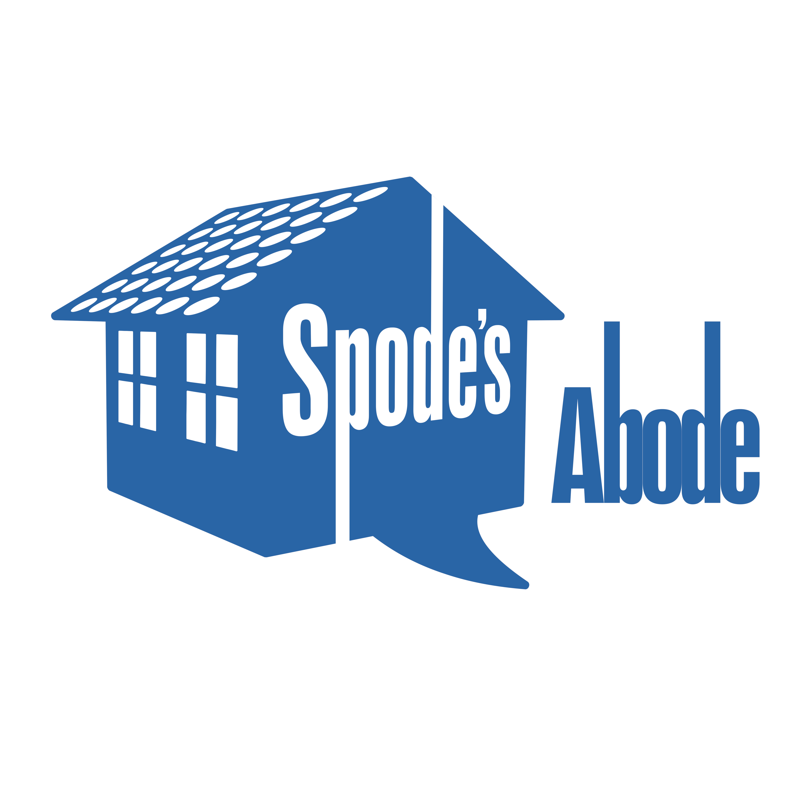

# Main Heading
## Second Level Heading
### Third Level Heading

Regular paragraph with *italic*, **bold**, and ***bold italic*** text. Here's a [link to somewhere](#) and some `inline code`.

> This is a blockquote
> It can span multiple lines
> And can contain **formatting**

Here's a list:
* Unordered item
* Another item
  * Nested item
  * Another nested item
* Back to main level

Numbered list:
1. First item
2. Second item
   1. Nested numbered
   2. Another nested
3. Back to main

Here's a code block:
```python
def hello_world():
    print("Hello from Python!")
    for i in range(5):
        print(f"Count: {i}")
```

Here's an image:

